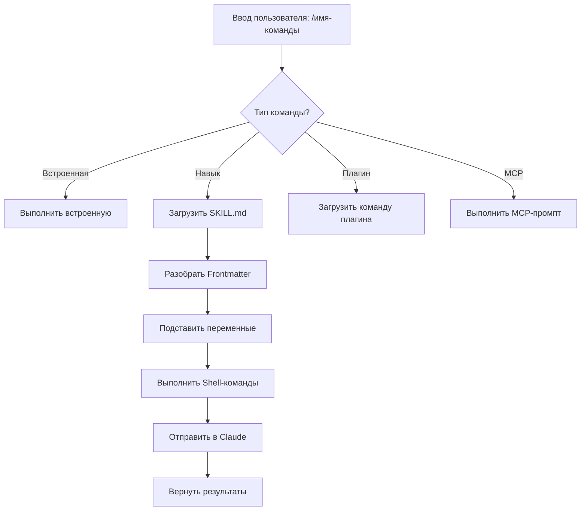
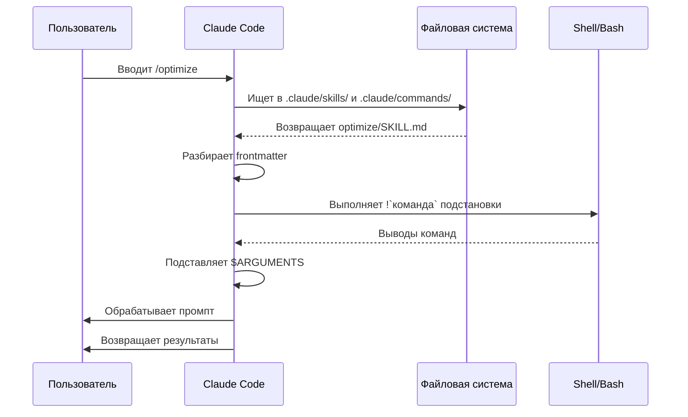

<picture>
  <source media="(prefers-color-scheme: dark)" srcset="../resources/logos/claude-howto-logo-dark.svg">
  
</picture>

# Слэш-команды

## Обзор

Слэш-команды — это ярлыки для управления поведением Claude во время интерактивной сессии. Они бывают нескольких типов:

- **Встроенные команды**: Предоставляемые Claude Code (`/help`, `/clear`, `/model`)
- **Навыки**: Пользовательские команды, создаваемые как файлы `SKILL.md` (`/optimize`, `/pr`)
- **Команды плагинов**: Команды из установленных плагинов (`/frontend-design:frontend-design`)
- **MCP-промпты**: Команды от MCP-серверов (`/mcp__github__list_prs`)

> **Примечание**: Кастомные слэш-команды были объединены с навыками. Файлы в `.claude/commands/` по-прежнему работают, но навыки (`.claude/skills/`) — рекомендуемый подход. Оба способа создают ярлыки `/имя-команды`. Смотри [Руководство по навыкам](../03-skills/) для полного справочника.

## Справочник встроенных команд

Встроенные команды — ярлыки для общих действий. Доступно **55+ встроенных команд** и **5 встроенных навыков**. Введи `/` в Claude Code, чтобы увидеть полный список, или введи `/` с любыми буквами для фильтрации.

| Команда | Назначение |
|---------|-----------|
| `/add-dir <путь>` | Добавить рабочую директорию |
| `/agents` | Управление конфигурациями агентов |
| `/branch [имя]` | Разветвить разговор в новую сессию (псевдоним: `/fork`). Примечание: `/fork` переименован в `/branch` в v2.1.77 |
| `/btw <вопрос>` | Боковой вопрос без добавления в историю |
| `/chrome` | Настройка интеграции с браузером Chrome |
| `/clear` | Очистить разговор (псевдонимы: `/reset`, `/new`) |
| `/color [цвет\|default]` | Установить цвет строки промпта |
| `/compact [инструкции]` | Сжать разговор с необязательными инструкциями по фокусировке |
| `/config` | Открыть настройки (псевдоним: `/settings`) |
| `/context` | Визуализировать использование контекста как цветовую сетку |
| `/copy [N]` | Скопировать ответ ассистента в буфер обмена; `w` записывает в файл |
| `/cost` | Показать статистику использования токенов |
| `/desktop` | Продолжить в Desktop-приложении (псевдоним: `/app`) |
| `/diff` | Интерактивный просмотр diff для незафиксированных изменений |
| `/doctor` | Диагностика состояния установки |
| `/effort [low\|medium\|high\|max\|auto]` | Установить уровень усилий. `max` требует Opus 4.6 |
| `/exit` | Выйти из REPL (псевдоним: `/quit`) |
| `/export [имя_файла]` | Экспортировать текущий разговор в файл или буфер обмена |
| `/extra-usage` | Настройка дополнительного использования для ограничений скорости |
| `/fast [on\|off]` | Переключить быстрый режим |
| `/feedback` | Отправить отзыв (псевдоним: `/bug`) |
| `/help` | Показать справку |
| `/hooks` | Просмотр конфигураций хуков |
| `/ide` | Управление интеграциями IDE |
| `/init` | Инициализировать `CLAUDE.md`. Установи `CLAUDE_CODE_NEW_INIT=true` для интерактивного режима |
| `/insights` | Создать отчёт анализа сессии |
| `/install-github-app` | Настроить приложение GitHub Actions |
| `/install-slack-app` | Установить приложение Slack |
| `/keybindings` | Открыть конфигурацию привязок клавиш |
| `/login` | Переключить аккаунты Anthropic |
| `/logout` | Выйти из аккаунта Anthropic |
| `/mcp` | Управление MCP-серверами и OAuth |
| `/memory` | Редактировать `CLAUDE.md`, переключить авто-память |
| `/mobile` | QR-код для мобильного приложения (псевдонимы: `/ios`, `/android`) |
| `/model [модель]` | Выбрать модель со стрелками влево/вправо для уровня усилий |
| `/passes` | Поделиться бесплатной неделей Claude Code |
| `/permissions` | Просмотр/обновление разрешений (псевдоним: `/allowed-tools`) |
| `/plan [описание]` | Войти в режим планирования |
| `/plugin` | Управление плагинами |
| `/pr-comments [PR]` | Получить комментарии к GitHub PR |
| `/privacy-settings` | Настройки конфиденциальности (только Pro/Max) |
| `/release-notes` | Просмотр журнала изменений |
| `/reload-plugins` | Перезагрузить активные плагины |
| `/remote-control` | Удалённое управление с claude.ai (псевдоним: `/rc`) |
| `/remote-env` | Настроить удалённое окружение по умолчанию |
| `/rename [имя]` | Переименовать сессию |
| `/resume [сессия]` | Возобновить разговор (псевдоним: `/continue`) |
| `/review` | **Устарела** — установи плагин `code-review` вместо этого |
| `/rewind` | Перемотать разговор и/или код (псевдоним: `/checkpoint`) |
| `/sandbox` | Переключить режим песочницы |
| `/schedule [описание]` | Создать/управлять запланированными задачами |
| `/security-review` | Анализировать ветку на уязвимости безопасности |
| `/skills` | Список доступных навыков |
| `/stats` | Визуализировать ежедневное использование, сессии, серии |
| `/status` | Показать версию, модель, аккаунт |
| `/statusline` | Настроить строку статуса |
| `/tasks` | Список/управление фоновыми задачами |
| `/terminal-setup` | Настроить привязки клавиш терминала |
| `/theme` | Изменить цветовую тему |
| `/vim` | Переключить режимы Vim/Normal |
| `/voice` | Переключить голосовой ввод push-to-talk |

### Встроенные навыки

Эти навыки поставляются с Claude Code и вызываются как слэш-команды:

| Навык | Назначение |
|-------|-----------|
| `/batch <инструкция>` | Оркестрировать масштабные параллельные изменения с использованием worktrees |
| `/claude-api` | Загрузить справочник API Claude для языка проекта |
| `/debug [описание]` | Включить журналирование отладки |
| `/loop [интервал] <промпт>` | Запускать промпт повторно с заданным интервалом |
| `/simplify [фокус]` | Проверить изменённые файлы на качество кода |

### Устаревшие команды

| Команда | Статус |
|---------|--------|
| `/review` | Устарела — заменена плагином `code-review` |
| `/output-style` | Устарела с v2.1.73 |
| `/fork` | Переименована в `/branch` (псевдоним всё ещё работает, v2.1.77) |

### Последние изменения

- `/fork` переименована в `/branch`, `/fork` оставлена как псевдоним (v2.1.77)
- `/output-style` устарела (v2.1.73)
- `/review` устарела в пользу плагина `code-review`
- Добавлена команда `/effort` с уровнем `max`, требующим Opus 4.6
- Добавлена команда `/voice` для голосового ввода push-to-talk
- Добавлена команда `/schedule` для создания/управления запланированными задачами
- Добавлена команда `/color` для настройки строки промпта
- Выборщик `/model` теперь показывает читаемые метки (например, «Sonnet 4.6») вместо сырых ID моделей
- `/resume` поддерживает псевдоним `/continue`
- MCP-промпты доступны как команды `/mcp__<сервер>__<промпт>` (смотри [MCP-промпты как команды](#mcp-промпты-как-команды))

## Кастомные команды (теперь Навыки)

Кастомные слэш-команды были **объединены с навыками**. Оба подхода создают команды, которые можно вызывать как `/имя-команды`:

| Подход | Расположение | Статус |
|--------|-------------|--------|
| **Навыки (Рекомендуется)** | `.claude/skills/<имя>/SKILL.md` | Текущий стандарт |
| **Устаревшие команды** | `.claude/commands/<имя>.md` | Всё ещё работает |

Если навык и команда имеют одинаковое имя, **навык имеет приоритет**. Например, когда существуют оба файла `.claude/commands/review.md` и `.claude/skills/review/SKILL.md`, используется версия навыка.

### Путь миграции

Существующие файлы `.claude/commands/` продолжают работать без изменений. Для миграции на навыки:

**До (команда):**
```
.claude/commands/optimize.md
```

**После (навык):**
```
.claude/skills/optimize/SKILL.md
```

### Почему навыки?

Навыки предлагают дополнительные возможности по сравнению с устаревшими командами:

- **Структура директорий**: Бандлирование скриптов, шаблонов и справочных файлов
- **Авто-вызов**: Claude может автоматически запускать навыки при необходимости
- **Управление вызовом**: Выбор того, кто может вызывать — пользователи, Claude или оба
- **Выполнение субагентом**: Запуск навыков в изолированных контекстах с `context: fork`
- **Прогрессивное раскрытие**: Загрузка дополнительных файлов только при необходимости

### Создание кастомной команды как навыка

Создай директорию с файлом `SKILL.md`:

```bash
mkdir -p .claude/skills/my-command
```

**Файл:** `.claude/skills/my-command/SKILL.md`

```yaml
---
name: my-command
description: Что делает эта команда и когда её использовать
---

# Моя команда

Инструкции для Claude при вызове этой команды.

1. Первый шаг
2. Второй шаг
3. Третий шаг
```

### Справочник по Frontmatter

| Поле | Назначение | По умолчанию |
|------|-----------|--------------|
| `name` | Имя команды (становится `/имя`) | Имя директории |
| `description` | Краткое описание (помогает Claude знать, когда использовать) | Первый абзац |
| `argument-hint` | Ожидаемые аргументы для авто-дополнения | Нет |
| `allowed-tools` | Инструменты, которые команда может использовать без разрешения | Наследуется |
| `model` | Конкретная модель для использования | Наследуется |
| `disable-model-invocation` | Если `true`, только пользователь может вызвать (не Claude) | `false` |
| `user-invocable` | Если `false`, скрыть из меню `/` | `true` |
| `context` | Установить `fork` для запуска в изолированном субагенте | Нет |
| `agent` | Тип агента при использовании `context: fork` | `general-purpose` |
| `hooks` | Хуки уровня навыка (PreToolUse, PostToolUse, Stop) | Нет |

### Аргументы

Команды могут принимать аргументы:

**Все аргументы через `$ARGUMENTS`:**

```yaml
---
name: fix-issue
description: Исправить задачу GitHub по номеру
---

Исправь задачу #$ARGUMENTS, следуя нашим стандартам кодирования
```

Использование: `/fix-issue 123` → `$ARGUMENTS` становится «123»

**Отдельные аргументы через `$0`, `$1` и т.д.:**

```yaml
---
name: review-pr
description: Проверить PR с приоритетом
---

Проверь PR #$0 с приоритетом $1
```

Использование: `/review-pr 456 high` → `$0`=«456», `$1`=«high»

### Динамический контекст через Shell-команды

Выполни bash-команды перед промптом, используя `` !`команда` ``:

```yaml
---
name: commit
description: Создать git-коммит с контекстом
allowed-tools: Bash(git *)
---

## Контекст

- Текущий статус git: !`git status`
- Текущий git diff: !`git diff HEAD`
- Текущая ветка: !`git branch --show-current`
- Последние коммиты: !`git log --oneline -5`

## Твоя задача

На основе приведённых выше изменений создай один git-коммит.
```

### Ссылки на файлы

Включи содержимое файлов с помощью `@`:

```markdown
Проверь реализацию в @src/utils/helpers.js
Сравни @src/old-version.js с @src/new-version.js
```

## Команды плагинов

Плагины могут предоставлять кастомные команды:

```
/имя-плагина:имя-команды
```

Или просто `/имя-команды`, когда нет конфликтов имён.

**Примеры:**
```bash
/frontend-design:frontend-design
/commit-commands:commit
```

## MCP-промпты как команды

MCP-серверы могут предоставлять промпты как слэш-команды:

```
/mcp__<имя-сервера>__<имя-промпта> [аргументы]
```

**Примеры:**
```bash
/mcp__github__list_prs
/mcp__github__pr_review 456
/mcp__jira__create_issue "Заголовок бага" high
```

### Синтаксис разрешений MCP

Управление доступом к MCP-серверу в разрешениях:

- `mcp__github` — Доступ ко всему GitHub MCP-серверу
- `mcp__github__*` — Подстановочный доступ ко всем инструментам
- `mcp__github__get_issue` — Доступ к конкретному инструменту

## Архитектура команд



## Жизненный цикл команды



## Доступные команды в этой папке

Эти примеры команд можно установить как навыки или устаревшие команды.

### 1. `/optimize` — Оптимизация кода

Анализирует код на проблемы производительности, утечки памяти и возможности оптимизации.

**Использование:**
```
/optimize
[Вставь свой код]
```

### 2. `/pr` — Подготовка Pull Request

Проводит через чек-лист подготовки PR, включая линтинг, тестирование и форматирование коммитов.

**Использование:**
```
/pr
```

### 3. `/generate-api-docs` — Генератор API-документации

Генерирует комплексную API-документацию из исходного кода.

**Использование:**
```
/generate-api-docs
```

### 4. `/commit` — Git-коммит с контекстом

Создаёт git-коммит с динамическим контекстом из твоего репозитория.

**Использование:**
```
/commit [необязательное сообщение]
```

### 5. `/push-all` — Подготовить, зафиксировать и отправить

Подготавливает все изменения, создаёт коммит и отправляет на удалённый сервер с проверками безопасности.

**Использование:**
```
/push-all
```

**Проверки безопасности:**
- Секреты: `.env*`, `*.key`, `*.pem`, `credentials.json`
- API-ключи: Обнаружение реальных ключей против заполнителей
- Большие файлы: `>10MB` без Git LFS
- Артефакты сборки: `node_modules/`, `dist/`, `__pycache__/`

### 6. `/doc-refactor` — Реструктуризация документации

Реструктурирует документацию проекта для ясности и доступности.

**Использование:**
```
/doc-refactor
```

### 7. `/setup-ci-cd` — Настройка CI/CD пайплайна

Реализует pre-commit хуки и GitHub Actions для контроля качества.

**Использование:**
```
/setup-ci-cd
```

### 8. `/unit-test-expand` — Расширение покрытия тестами

Увеличивает покрытие тестами, нацеливаясь на непротестированные ветки и граничные случаи.

**Использование:**
```
/unit-test-expand
```

## Установка

### Как навыки (Рекомендуется)

Скопируй в директорию навыков:

```bash
# Создать директорию навыков
mkdir -p .claude/skills

# Для каждого файла команды создать директорию навыка
for cmd in optimize pr commit; do
  mkdir -p .claude/skills/$cmd
  cp 01-slash-commands/$cmd.md .claude/skills/$cmd/SKILL.md
done
```

### Как устаревшие команды

Скопируй в директорию команд:

```bash
# Для всей команды (командный уровень)
mkdir -p .claude/commands
cp 01-slash-commands/*.md .claude/commands/

# Для личного использования
mkdir -p ~/.claude/commands
cp 01-slash-commands/*.md ~/.claude/commands/
```

## Создание собственных команд

### Шаблон навыка (Рекомендуется)

Создай `.claude/skills/my-command/SKILL.md`:

```yaml
---
name: my-command
description: Что делает команда. Использовать когда [условия запуска].
argument-hint: [необязательные-аргументы]
allowed-tools: Bash(npm *), Read, Grep
---

# Заголовок команды

## Контекст

- Текущая ветка: !`git branch --show-current`
- Связанные файлы: @package.json

## Инструкции

1. Первый шаг
2. Второй шаг с аргументом: $ARGUMENTS
3. Третий шаг

## Формат вывода

- Как форматировать ответ
- Что включать
```

### Команда только для пользователя (без авто-вызова)

Для команд с побочными эффектами, которые Claude не должен запускать автоматически:

```yaml
---
name: deploy
description: Деплой в production
disable-model-invocation: true
allowed-tools: Bash(npm *), Bash(git *)
---

Задеплой приложение в production:

1. Запустить тесты
2. Собрать приложение
3. Отправить на целевой сервер деплоя
4. Проверить деплой
```

## Лучшие практики

| Делай | Не делай |
|-------|---------|
| Используй чёткие, ориентированные на действие имена | Создавать команды для разовых задач |
| Включай `description` с условиями запуска | Встраивать сложную логику в команды |
| Держи команды сфокусированными на одной задаче | Хардкодить чувствительную информацию |
| Используй `disable-model-invocation` для побочных эффектов | Пропускать поле description |
| Используй префикс `!` для динамического контекста | Предполагать, что Claude знает текущее состояние |
| Организуй связанные файлы в директориях навыков | Помещать всё в один файл |

## Устранение неполадок

### Команда не найдена

**Решения:**
- Проверь, что файл находится в `.claude/skills/<имя>/SKILL.md` или `.claude/commands/<имя>.md`
- Проверь, что поле `name` в frontmatter совпадает с ожидаемым именем команды
- Перезапусти сессию Claude Code
- Запусти `/help`, чтобы увидеть доступные команды

### Команда выполняется не так, как ожидалось

**Решения:**
- Добавь более конкретные инструкции
- Включи примеры в файл навыка
- Проверь `allowed-tools`, если используешь bash-команды
- Тестируй с простыми входными данными сначала

### Конфликт навыка и команды

Если оба существуют с одним именем, **навык имеет приоритет**. Удали один или переименуй.

## Связанные руководства

- **[Навыки](../03-skills/)** — Полный справочник по навыкам (авто-вызываемые возможности)
- **[Память](../02-memory/)** — Постоянный контекст с CLAUDE.md
- **[Субагенты](../04-subagents/)** — Делегированные ИИ-агенты
- **[Плагины](../07-plugins/)** — Бандлированные коллекции команд
- **[Хуки](../06-hooks/)** — Автоматизация по событиям

## Дополнительные ресурсы

- [Официальная документация по интерактивному режиму](https://code.claude.com/docs/en/interactive-mode) — Справочник встроенных команд
- [Официальная документация по навыкам](https://code.claude.com/docs/en/skills) — Полный справочник по навыкам
- [CLI-справочник](https://code.claude.com/docs/en/cli-reference) — Параметры командной строки

---

*Часть серии руководств [Claude How To](../)*
