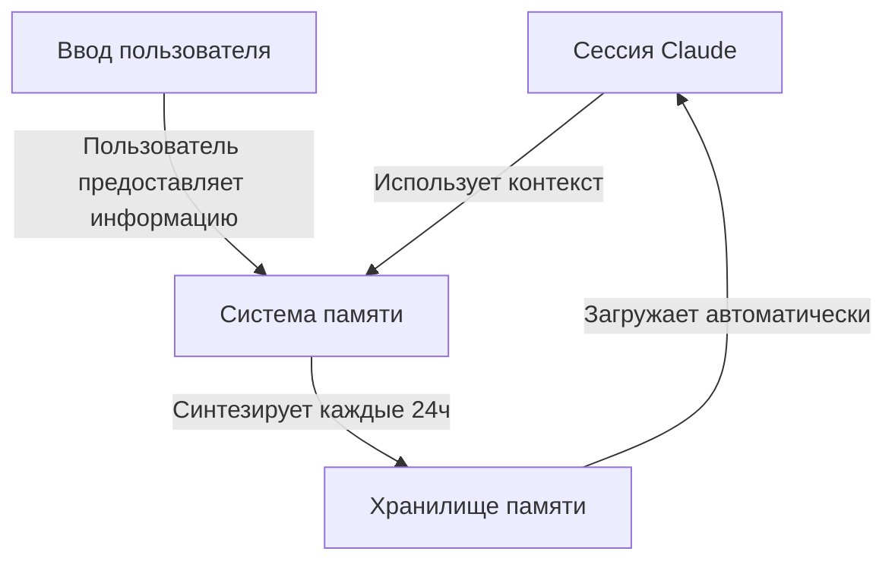

<picture>
  <source media="(prefers-color-scheme: dark)" srcset="../resources/logos/claude-howto-logo-dark.svg">
  
</picture>

# Руководство по памяти

Память позволяет Claude сохранять контекст между сессиями и разговорами. Она существует в двух формах: автоматический синтез в claude.ai и файловая система CLAUDE.md в Claude Code.

## Обзор

Память в Claude Code обеспечивает постоянный контекст, который сохраняется между несколькими сессиями и разговорами. В отличие от временных контекстных окон, файлы памяти позволяют:

- Делиться стандартами проекта с командой
- Хранить личные предпочтения разработки
- Поддерживать правила и конфигурации для конкретных директорий
- Импортировать внешнюю документацию
- Контролировать память как часть проекта через систему контроля версий

Система памяти работает на нескольких уровнях — от глобальных личных предпочтений до конкретных поддиректорий, обеспечивая детальный контроль над тем, что помнит Claude и как он применяет эти знания.

## Быстрый справочник команд памяти

| Команда | Назначение | Использование | Когда применять |
|---------|-----------|---------------|-----------------|
| `/init` | Инициализировать память проекта | `/init` | Начало нового проекта, первоначальная настройка CLAUDE.md |
| `/memory` | Редактировать файлы памяти в редакторе | `/memory` | Обширные обновления, реорганизация, проверка содержимого |
| Префикс `#` | Быстрое добавление одной строки в память | `# Твоё правило здесь` | Добавление быстрых правил во время разговора |
| `# новое правило в память` | Явное добавление в память | `# новое правило в память<br/>Твоё подробное правило` | Добавление сложных многострочных правил |
| `# запомни это` | Естественная языковая память | `# запомни это<br/>Твоя инструкция` | Разговорные обновления памяти |
| `@путь/к/файлу` | Импорт внешнего контента | `@README.md` или `@docs/api.md` | Ссылка на существующую документацию в CLAUDE.md |

## Быстрый старт: Инициализация памяти

### Команда `/init`

Команда `/init` — самый быстрый способ настроить память проекта в Claude Code. Она инициализирует файл CLAUDE.md с базовой документацией проекта.

**Использование:**

```bash
/init
```

**Что делает:**

- Создаёт новый файл CLAUDE.md в твоём проекте (обычно в `./CLAUDE.md` или `./.claude/CLAUDE.md`)
- Устанавливает соглашения и руководства проекта
- Создаёт основу для сохранения контекста между сессиями
- Предоставляет шаблонную структуру для документирования стандартов проекта

**Расширенный интерактивный режим:** Установи `CLAUDE_CODE_NEW_INIT=true` для включения многоэтапного интерактивного процесса, который проведёт тебя через настройку проекта шаг за шагом:

```bash
CLAUDE_CODE_NEW_INIT=true claude
/init
```

**Когда использовать `/init`:**

- Начало нового проекта с Claude Code
- Установка стандартов и соглашений командного кодирования
- Создание документации о структуре кодовой базы
- Настройка иерархии памяти для совместной разработки

**Пример рабочего процесса:**

```markdown
# В директории проекта
/init

# Claude создаёт CLAUDE.md со структурой вроде:
# Конфигурация проекта
## Обзор проекта
- Название: Твой Проект
- Технологический стек: [Твои технологии]
- Размер команды: [Количество разработчиков]

## Стандарты разработки
- Предпочтения стиля кода
- Требования к тестированию
- Соглашения по Git-рабочему процессу
```

### Быстрые обновления памяти с `#`

Можно быстро добавлять информацию в память во время любого разговора, начав сообщение с `#`:

**Синтаксис:**

```markdown
# Твоё правило или инструкция для памяти здесь
```

**Примеры:**

```markdown
# Всегда использовать TypeScript strict mode в этом проекте

# Предпочитать async/await вместо цепочек промисов

# Запускать npm test перед каждым коммитом

# Использовать kebab-case для имён файлов
```

**Как работает:**

1. Начни сообщение с `#` и своим правилом
2. Claude распознаёт это как запрос обновления памяти
3. Claude спрашивает, в какой файл памяти добавить (проект или личный)
4. Правило добавляется в соответствующий файл CLAUDE.md
5. Будущие сессии автоматически загружают этот контекст

**Альтернативные паттерны:**

```markdown
# новое правило в память
Всегда валидировать пользовательский ввод с помощью схем Zod

# запомни это
Использовать семантическое версионирование для всех релизов

# добавить в память
Миграции базы данных должны быть обратимыми
```

### Команда `/memory`

Команда `/memory` предоставляет прямой доступ для редактирования файлов памяти CLAUDE.md в сессиях Claude Code. Она открывает файлы памяти в системном редакторе для комплексного редактирования.

**Использование:**

```bash
/memory
```

**Что делает:**

- Открывает файлы памяти в системном редакторе по умолчанию
- Позволяет делать обширные добавления, изменения и реорганизации
- Предоставляет прямой доступ ко всем файлам памяти в иерархии
- Позволяет управлять постоянным контекстом между сессиями

**Когда использовать `/memory`:**

- Проверка существующего содержимого памяти
- Обширные обновления стандартов проекта
- Реорганизация структуры памяти
- Добавление подробной документации или руководств
- Поддержание и обновление памяти по мере развития проекта

**Сравнение: `/memory` vs `/init`**

| Аспект | `/memory` | `/init` |
|--------|-----------|---------|
| **Назначение** | Редактировать существующие файлы памяти | Инициализировать новый CLAUDE.md |
| **Когда использовать** | Обновление/изменение контекста проекта | Начало новых проектов |
| **Действие** | Открывает редактор для изменений | Генерирует стартовый шаблон |
| **Рабочий процесс** | Текущее обслуживание | Одноразовая настройка |

## Архитектура памяти

Память в Claude Code следует иерархической системе, где разные области служат разным целям:



## Иерархия памяти в Claude Code

Claude Code использует многоуровневую иерархическую систему памяти. Файлы памяти автоматически загружаются при запуске Claude Code, с файлами более высокого уровня, имеющими приоритет.

**Полная иерархия памяти (в порядке приоритета):**

1. **Управляемая политика** — Инструкции на уровне организации
   - macOS: `/Library/Application Support/ClaudeCode/CLAUDE.md`
   - Linux/WSL: `/etc/claude-code/CLAUDE.md`
   - Windows: `C:\Program Files\ClaudeCode\CLAUDE.md`

2. **Управляемые дополнения** — Файлы политик, объединяемые в алфавитном порядке (v2.1.83+)
   - Директория `managed-settings.d/` рядом с управляемым CLAUDE.md политики
   - Файлы объединяются в алфавитном порядке для модульного управления политиками

3. **Память проекта** — Разделяемый командой контекст (под контролем версий)
   - `./.claude/CLAUDE.md` или `./CLAUDE.md` (в корне репозитория)

4. **Правила проекта** — Модульные, тематические инструкции проекта
   - `./.claude/rules/*.md`

5. **Пользовательская память** — Личные предпочтения (все проекты)
   - `~/.claude/CLAUDE.md`

6. **Пользовательские правила** — Личные правила (все проекты)
   - `~/.claude/rules/*.md`

7. **Локальная память проекта** — Личные предпочтения для конкретного проекта
   - `./CLAUDE.local.md`

8. **Авто-память** — Автоматические заметки и знания Claude
   - `~/.claude/projects/<проект>/memory/`

## Исключение файлов CLAUDE.md с `claudeMdExcludes`

В больших монорепозиториях некоторые файлы CLAUDE.md могут быть не актуальны для текущей работы. Настройка `claudeMdExcludes` позволяет пропускать конкретные файлы CLAUDE.md, чтобы они не загружались в контекст:

```jsonc
// В ~/.claude/settings.json или .claude/settings.json
{
  "claudeMdExcludes": [
    "packages/legacy-app/CLAUDE.md",
    "vendors/**/CLAUDE.md"
  ]
}
```

Паттерны сопоставляются с путями относительно корня проекта. Это особенно полезно для:

- Монорепозиториев со многими подпроектами, где актуальны только некоторые
- Репозиториев, содержащих вендорные или сторонние файлы CLAUDE.md
- Уменьшения шума в контекстном окне Claude путём исключения устаревших инструкций

## Иерархия файлов настроек

Настройки Claude Code (включая `autoMemoryDirectory`, `claudeMdExcludes` и другие) разрешаются из пятиуровневой иерархии, с более высокими уровнями, имеющими приоритет:

| Уровень | Расположение | Область |
|---------|-------------|---------|
| 1 (Наивысший) | Управляемая политика (системный уровень) | Применение на уровне организации |
| 2 | `managed-settings.d/` (v2.1.83+) | Модульные дополнения политики, объединяемые в алфавитном порядке |
| 3 | `~/.claude/settings.json` | Пользовательские предпочтения |
| 4 | `.claude/settings.json` | Уровень проекта (зафиксировано в git) |
| 5 (Наинизший) | `.claude/settings.local.json` | Локальные переопределения (игнорируется git) |

## Модульная система правил

Создавай организованные, путезависимые правила, используя структуру директории `.claude/rules/`. Правила могут быть определены как на уровне проекта, так и на уровне пользователя:

```
твой-проект/
├── .claude/
│   ├── CLAUDE.md
│   └── rules/
│       ├── code-style.md
│       ├── testing.md
│       ├── security.md
│       └── api/
│           ├── conventions.md
│           └── validation.md

~/.claude/
├── CLAUDE.md
└── rules/
    ├── personal-style.md
    └── preferred-patterns.md
```

### Путезависимые правила с YAML Frontmatter

Определяй правила, применяемые только к конкретным путям файлов:

```markdown
---
paths: src/api/**/*.ts
---

# Правила разработки API

- Все API-эндпоинты должны включать валидацию входных данных
- Использовать Zod для валидации схем
- Документировать все параметры и типы ответов
- Включать обработку ошибок для всех операций
```

**Примеры glob-паттернов:**

- `**/*.ts` — Все TypeScript файлы
- `src/**/*` — Все файлы в src/
- `src/**/*.{ts,tsx}` — Несколько расширений
- `{src,lib}/**/*.ts, tests/**/*.test.ts` — Несколько паттернов

## Авто-память

Авто-память — это постоянная директория, в которую Claude автоматически записывает знания, паттерны и выводы по мере работы с твоим проектом. В отличие от файлов CLAUDE.md, которые ты пишешь и поддерживаешь вручную, авто-память записывается самим Claude во время сессий.

### Как работает авто-память

- **Расположение**: `~/.claude/projects/<проект>/memory/`
- **Точка входа**: `MEMORY.md` служит основным файлом в директории авто-памяти
- **Тематические файлы**: Необязательные дополнительные файлы для конкретных тем (например, `debugging.md`, `api-conventions.md`)
- **Поведение загрузки**: Первые 200 строк `MEMORY.md` загружаются в системный промпт при запуске сессии. Тематические файлы загружаются по запросу, не при запуске.
- **Чтение/запись**: Claude читает и записывает файлы памяти во время сессий по мере обнаружения паттернов и специфичных для проекта знаний

### Требования к версии

Авто-память требует **Claude Code v2.1.59 или новее**. Если используется более старая версия:

```bash
npm install -g @anthropic-ai/claude-code@latest
```

### Кастомная директория авто-памяти

По умолчанию авто-память хранится в `~/.claude/projects/<проект>/memory/`. Можно изменить это расположение с помощью настройки `autoMemoryDirectory` (доступно с **v2.1.74**):

```jsonc
// В ~/.claude/settings.json или .claude/settings.local.json (только пользовательские/локальные настройки)
{
  "autoMemoryDirectory": "/путь/к/кастомной/директории/памяти"
}
```

### Управление авто-памятью

Авто-память можно контролировать через переменную окружения `CLAUDE_CODE_DISABLE_AUTO_MEMORY`:

| Значение | Поведение |
|---------|----------|
| `0` | Принудительно **включить** авто-память |
| `1` | Принудительно **отключить** авто-память |
| *(не задано)* | Поведение по умолчанию (авто-память включена) |

```bash
# Отключить авто-память для сессии
CLAUDE_CODE_DISABLE_AUTO_MEMORY=1 claude

# Явно включить авто-память
CLAUDE_CODE_DISABLE_AUTO_MEMORY=0 claude
```

## Практические примеры

### Пример 1: Структура памяти проекта

**Файл:** `./CLAUDE.md`

```markdown
# Конфигурация проекта

## Обзор проекта
- **Название**: E-commerce платформа
- **Технологический стек**: Node.js, PostgreSQL, React 18, Docker
- **Размер команды**: 5 разработчиков

## Архитектура
@docs/architecture.md
@docs/api-standards.md
@docs/database-schema.md

## Стандарты разработки

### Стиль кода
- Использовать Prettier для форматирования
- Использовать ESLint с конфигом airbnb
- Максимальная длина строки: 100 символов
- Использовать отступ 2 пробела

### Соглашения об именовании
- **Файлы**: kebab-case (user-controller.js)
- **Классы**: PascalCase (UserService)
- **Функции/переменные**: camelCase (getUserById)
- **Константы**: UPPER_SNAKE_CASE (API_BASE_URL)
- **Таблицы БД**: snake_case (user_accounts)

### Git-рабочий процесс
- Имена веток: `feature/описание` или `fix/описание`
- Сообщения коммитов: следовать conventional commits
- PR обязателен перед слиянием
- Все проверки CI/CD должны пройти
- Минимум 1 одобрение обязательно

### Требования к тестированию
- Минимальное покрытие кода: 80%
- Все критические пути должны иметь тесты
- Использовать Jest для модульных тестов
- Использовать Cypress для E2E тестов

## Общие команды

| Команда | Назначение |
|---------|-----------|
| `npm run dev` | Запустить сервер разработки |
| `npm test` | Запустить набор тестов |
| `npm run lint` | Проверить стиль кода |
| `npm run build` | Собрать для production |
| `npm run migrate` | Запустить миграции БД |
```

### Пример 2: Память для конкретной директории

**Файл:** `./src/api/CLAUDE.md`

```markdown
# Стандарты модуля API

Этот файл переопределяет корневой CLAUDE.md для всего в /src/api/

## API-специфичные стандарты

### Валидация запросов
- Использовать Zod для валидации схем
- Всегда валидировать ввод
- Возвращать 400 с ошибками валидации
- Включать детали ошибок на уровне полей

### Аутентификация
- Все эндпоинты требуют JWT-токен
- Токен в заголовке Authorization
- Токен истекает через 24 часа
- Реализовать механизм refresh-токена

### Формат ответа
Все ответы должны следовать этой структуре:

\`\`\`json
{
  "success": true,
  "data": { /* фактические данные */ },
  "timestamp": "2025-11-06T10:30:00Z",
  "version": "1.0"
}
\`\`\`
```

### Пример 3: Личная память

**Файл:** `~/.claude/CLAUDE.md`

```markdown
# Мои предпочтения разработки

## О себе
- **Уровень опыта**: 8 лет full-stack разработки
- **Предпочтительные языки**: TypeScript, Python
- **Стиль коммуникации**: Прямой, с примерами
- **Стиль обучения**: Визуальные диаграммы с кодом

## Предпочтения кода

### Обработка ошибок
Предпочитаю явную обработку ошибок с блоками try-catch и понятными сообщениями.
Избегать общих ошибок. Всегда логировать ошибки для отладки.

### Комментарии
Использовать комментарии для ПОЧЕМУ, не ЧТО. Код должен быть самодокументирующимся.
Комментарии должны объяснять бизнес-логику или неочевидные решения.

### Тестирование
Предпочитаю TDD (test-driven development).
Сначала писать тесты, потом реализацию.
Фокусироваться на поведении, а не деталях реализации.
```

### Пример 4: Обновление памяти во время сессии

Можно добавлять новые правила в память во время активной сессии Claude Code.

#### Метод 1: Прямой запрос

```markdown
Пользователь: Запомни, что я предпочитаю использовать React хуки вместо классовых
              компонентов для всех новых компонентов.

Claude: Добавляю это в твою память. В какой файл памяти поместить?
        1. Память проекта (./CLAUDE.md)
        2. Личная память (~/.claude/CLAUDE.md)

Пользователь: Память проекта

Claude: ✅ Память сохранена!
```

#### Метод 2: Паттерн "# новое правило в память"

```markdown
Пользователь: # новое правило в память
              Всегда валидировать пользовательский ввод с помощью схем Zod перед обработкой.

Claude: Сохраняю это правило в память. Какой файл памяти использовать?
        1. Память проекта (./CLAUDE.md)
        2. Личная память (~/.claude/CLAUDE.md)

Пользователь: Память проекта

Claude: ✅ Память сохранена!
```

#### Советы по добавлению памяти

- Будь конкретен и указывай actionable правила
- Группируй связанные правила под заголовком раздела
- Обновляй существующие разделы вместо дублирования контента
- Выбирай подходящую область памяти (проект vs. личная)

## Сравнение функций памяти

| Функция | Claude Web/Desktop | Claude Code (CLAUDE.md) |
|---------|-------------------|------------------------|
| Авто-синтез | ✅ Каждые 24ч | ❌ Вручную |
| Между проектами | ✅ Общий | ❌ Специфичный для проекта |
| Доступ команды | ✅ Общие проекты | ✅ Отслеживается git |
| Поиск | ✅ Встроенный | ✅ Через `/memory` |
| Редактирование | ✅ В чате | ✅ Прямое редактирование файла |
| Импорт/Экспорт | ✅ Да | ✅ Копирование/вставка |
| Постоянство | ✅ 24ч+ | ✅ Неограниченное |

## Лучшие практики

### Делай — Что включать

- **Будь конкретен и подробен**: Используй чёткие, детальные инструкции, а не размытые указания
  - ✅ Хорошо: «Использовать отступ 2 пробела для всех JavaScript-файлов»
  - ❌ Избегать: «Следовать лучшим практикам»

- **Держи организованным**: Структурируй файлы памяти с чёткими разделами Markdown

- **Используй подходящие уровни иерархии**:
  - **Управляемая политика**: Корпоративные политики, стандарты безопасности, требования соответствия
  - **Память проекта**: Стандарты команды, архитектура, соглашения кодирования (зафиксировать в git)
  - **Пользовательская память**: Личные предпочтения, стиль коммуникации, выбор инструментов
  - **Память директории**: Правила конкретного модуля и переопределения

- **Используй импорты**: Применяй синтаксис `@путь/к/файлу` для ссылки на существующую документацию
  - Поддерживает до 5 уровней рекурсивного вложения
  - Избегает дублирования между файлами памяти

- **Документируй частые команды**: Включай команды, которые используешь повторно

- **Контролируй память проекта**: Фиксируй файлы CLAUDE.md уровня проекта в git для пользы команды

- **Регулярно проверяй**: Обновляй память регулярно по мере развития проектов

### Не делай — Чего избегать

- **Не храни секреты**: Никогда не включай API-ключи, пароли, токены или учётные данные

- **Не включай чувствительные данные**: Никаких персональных данных, частной информации или конфиденциальных секретов

- **Не дублируй контент**: Используй импорты (`@путь`) для ссылки на существующую документацию

- **Не будь расплывчатым**: Избегай общих утверждений вроде «следовать лучшим практикам»

- **Не делай слишком длинным**: Держи отдельные файлы памяти сфокусированными и до 500 строк

- **Не превышай лимиты вложения**: Импорты памяти поддерживают до 5 уровней вложения

## Инструкции по установке

### Настройка памяти проекта

#### Метод 1: Использование команды `/init` (Рекомендуется)

1. **Перейди в директорию проекта:**
   ```bash
   cd /путь/к/твоему/проекту
   ```

2. **Запусти команду init в Claude Code:**
   ```bash
   /init
   ```

3. **Claude создаст и заполнит CLAUDE.md** шаблонной структурой

4. **Настрой сгенерированный файл** под потребности проекта

5. **Зафиксируй в git:**
   ```bash
   git add CLAUDE.md
   git commit -m "Инициализация памяти проекта через /init"
   ```

#### Метод 2: Ручное создание

```bash
# Создай CLAUDE.md в корне проекта
touch CLAUDE.md

# Зафиксируй в git
git add CLAUDE.md
git commit -m "Добавить конфигурацию памяти проекта"
```

#### Метод 3: Быстрые обновления с `#`

После создания CLAUDE.md добавляй правила быстро во время разговоров:

```markdown
# Использовать семантическое версионирование для всех релизов

# Всегда запускать тесты перед коммитом

# Предпочитать композицию перед наследованием
```

Claude предложит выбрать файл памяти для обновления.

### Настройка личной памяти

```bash
# Создай директорию ~/.claude
mkdir -p ~/.claude

# Создай личный CLAUDE.md
touch ~/.claude/CLAUDE.md
```

## Официальная документация

- **[Документация по памяти](https://code.claude.com/docs/en/memory)** — Полный справочник по системе памяти
- **[Справочник слэш-команд](https://code.claude.com/docs/en/interactive-mode)** — Все встроенные команды включая `/init` и `/memory`
- **[CLI-справочник](https://code.claude.com/docs/en/cli-reference)** — Документация интерфейса командной строки

## Связанные концепции

- [Протокол MCP](../05-mcp/) — Доступ к живым данным наряду с памятью
- [Слэш-команды](../01-slash-commands/) — Ярлыки для конкретной сессии
- [Навыки](../03-skills/) — Автоматизированные рабочие процессы с контекстом памяти

---

*Часть серии руководств [Claude How To](../)*
