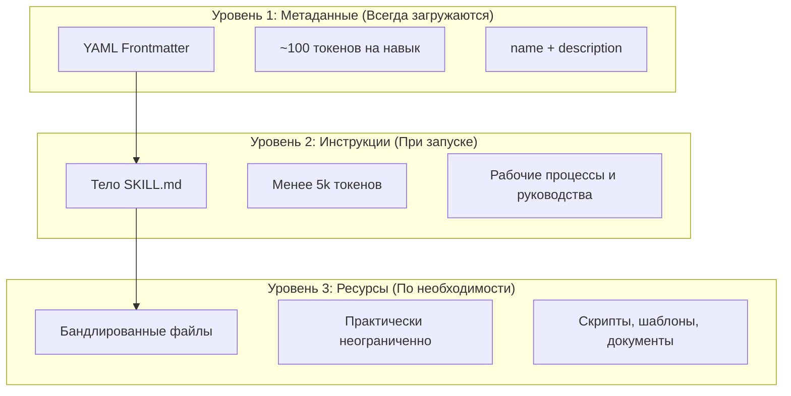

<picture>
  <source media="(prefers-color-scheme: dark)" srcset="../resources/logos/claude-howto-logo-dark.svg">
  
</picture>

# Руководство по навыкам агентов

Навыки агентов — это переиспользуемые, основанные на файловой системе возможности, расширяющие функциональность Claude. Они упаковывают доменную экспертизу, рабочие процессы и лучшие практики в обнаруживаемые компоненты, которые Claude автоматически использует при необходимости.

## Обзор

**Навыки агентов** — модульные возможности, превращающие агентов общего назначения в специалистов. В отличие от промптов (инструкций уровня разговора для разовых задач), навыки загружаются по запросу и устраняют необходимость повторного предоставления одинаковых инструкций в нескольких разговорах.

### Ключевые преимущества

- **Специализируй Claude**: Настраивай возможности для доменно-специфических задач
- **Уменьшай повторения**: Создай один раз, используй автоматически в разговорах
- **Комбинируй возможности**: Объединяй навыки для построения сложных рабочих процессов
- **Масштабируй рабочие процессы**: Переиспользуй навыки в нескольких проектах и командах
- **Поддерживай качество**: Встраивай лучшие практики прямо в рабочий процесс

Навыки следуют открытому стандарту [Agent Skills](https://agentskills.io), который работает в нескольких ИИ-инструментах. Claude Code расширяет стандарт дополнительными функциями: управлением вызовом, выполнением субагентами и динамическим внедрением контекста.

> **Примечание**: Кастомные слэш-команды были объединены с навыками. Файлы `.claude/commands/` всё ещё работают. Навыки рекомендуются для новых разработок. Когда оба существуют по одному пути, навык имеет приоритет.

## Как работают навыки: Прогрессивное раскрытие

Навыки используют архитектуру **прогрессивного раскрытия** — Claude загружает информацию поэтапно по мере необходимости, а не потребляет контекст заранее. Это обеспечивает эффективное управление контекстом при неограниченной масштабируемости.

### Три уровня загрузки



| Уровень | Когда загружается | Стоимость токенов | Содержимое |
|---------|------------------|-------------------|------------|
| **Уровень 1: Метаданные** | Всегда (при запуске) | ~100 токенов на навык | `name` и `description` из YAML frontmatter |
| **Уровень 2: Инструкции** | При запуске навыка | Менее 5k токенов | Тело SKILL.md с инструкциями и руководствами |
| **Уровень 3+: Ресурсы** | По необходимости | Практически неограниченно | Бандлированные файлы, выполняемые через bash без загрузки в контекст |

## Создание кастомных навыков

### Базовая структура директории

```
my-skill/
├── SKILL.md           # Основные инструкции (обязательно)
├── template.md        # Шаблон для заполнения Claude
├── examples/
│   └── sample.md      # Пример вывода показывающий ожидаемый формат
└── scripts/
    └── validate.sh    # Скрипт, который Claude может выполнить
```

### Формат SKILL.md

```yaml
---
name: имя-навыка
description: Краткое описание того, что делает навык и когда его использовать
---

# Название навыка

## Инструкции
Предоставь чёткие, пошаговые указания для Claude.

## Примеры
Покажи конкретные примеры использования навыка.
```

### Обязательные поля

- **name**: только строчные буквы, цифры, дефисы (максимум 64 символа). Не может содержать «anthropic» или «claude».
- **description**: что делает навык И когда его использовать (максимум 1024 символа). Критично для знания Claude, когда активировать навык.

### Необязательные поля Frontmatter

```yaml
---
name: my-skill
description: Что делает навык и когда его использовать
argument-hint: "[имя_файла] [формат]"         # Подсказка для авто-дополнения
disable-model-invocation: true               # Только пользователь может вызвать
user-invocable: false                        # Скрыть из меню slash
allowed-tools: Read, Grep, Glob             # Ограничить доступ к инструментам
model: opus                                  # Конкретная модель для использования
effort: high                                 # Переопределение уровня усилий (low, medium, high, max)
context: fork                                # Запустить в изолированном субагенте
agent: Explore                               # Тип агента (с context: fork)
shell: bash                                  # Оболочка для команд: bash (по умолчанию) или powershell
hooks:                                       # Хуки уровня навыка
  PreToolUse:
    - matcher: "Bash"
      hooks:
        - type: command
          command: "./scripts/validate.sh"
---
```

## Управление вызовом навыка

По умолчанию и пользователь, и Claude могут вызвать любой навык. Два поля frontmatter управляют тремя режимами вызова:

| Frontmatter | Пользователь может вызвать | Claude может вызвать |
|-------------|--------------------------|---------------------|
| (по умолчанию) | Да | Да |
| `disable-model-invocation: true` | Да | Нет |
| `user-invocable: false` | Нет | Да |

**Используй `disable-model-invocation: true`** для рабочих процессов с побочными эффектами: `/commit`, `/deploy`, `/send-slack-message`. Не хочешь, чтобы Claude решил делать деплой, потому что код выглядит готовым.

**Используй `user-invocable: false`** для фоновых знаний, которые не являются действием. Навык `legacy-system-context` объясняет, как работает старая система — полезно для Claude, но не имеющее смысла действие для пользователей.

## Подстановки строк

Навыки поддерживают динамические значения, разрешаемые до того, как содержимое навыка достигает Claude:

| Переменная | Описание |
|------------|---------|
| `$ARGUMENTS` | Все аргументы, переданные при вызове навыка |
| `$ARGUMENTS[N]` или `$N` | Доступ к конкретному аргументу по индексу (с нуля) |
| `${CLAUDE_SESSION_ID}` | ID текущей сессии |
| `${CLAUDE_SKILL_DIR}` | Директория, содержащая файл SKILL.md навыка |
| `` !`команда` `` | Динамическое внедрение контекста — выполняет shell-команду и встраивает вывод |

**Пример:**

```yaml
---
name: fix-issue
description: Исправить задачу GitHub
---

Исправь задачу GitHub $ARGUMENTS, следуя нашим стандартам кодирования.
1. Прочитай описание задачи
2. Реализуй исправление
3. Напиши тесты
4. Создай коммит
```

Запуск `/fix-issue 123` заменяет `$ARGUMENTS` на `123`.

## Запуск навыков в субагентах

Добавь `context: fork` для запуска навыка в изолированном контексте субагента. Содержимое навыка становится задачей для специального субагента с собственным контекстным окном, не загромождая основной разговор.

Поле `agent` указывает, какой тип агента использовать:

| Тип агента | Лучше всего для |
|------------|----------------|
| `Explore` | Исследование только для чтения, анализ кодовой базы |
| `Plan` | Создание планов реализации |
| `general-purpose` | Широкие задачи, требующие всех инструментов |
| Кастомные агенты | Специализированные агенты, определённые в конфигурации |

## Практические примеры

### Пример 1: Навык код-ревью

**Файл:** `~/.claude/skills/code-review/SKILL.md`

```yaml
---
name: code-review-specialist
description: Комплексный код-ревью с анализом безопасности, производительности и качества. Использовать, когда пользователи просят проверить код, проанализировать качество кода, оценить pull request или упоминают код-ревью, анализ безопасности или оптимизацию производительности.
---

# Навык код-ревью

Этот навык обеспечивает комплексные возможности код-ревью, фокусируясь на:

1. **Анализе безопасности**
   - Проблемы аутентификации/авторизации
   - Риски раскрытия данных
   - Уязвимости инъекций
   - Криптографические слабости

2. **Ревью производительности**
   - Эффективность алгоритмов (анализ Big O)
   - Оптимизация памяти
   - Оптимизация запросов к БД
   - Возможности кэширования

3. **Качество кода**
   - Принципы SOLID
   - Паттерны проектирования
   - Соглашения об именовании
   - Покрытие тестами

4. **Сопровождаемость**
   - Читаемость кода
   - Размер функций (должен быть < 50 строк)
   - Цикломатическая сложность
   - Типовая безопасность
```

### Пример 2: Навык деплоя (только для пользователя)

```yaml
---
name: deploy
description: Задеплоить приложение в production
disable-model-invocation: true
allowed-tools: Bash(npm *), Bash(git *)
---

Задеплой $ARGUMENTS в production:

1. Запустить набор тестов: `npm test`
2. Собрать приложение: `npm run build`
3. Отправить на целевой сервер деплоя
4. Проверить успешность деплоя
5. Отчитаться о статусе деплоя
```

### Пример 3: Навык голоса бренда (фоновые знания)

```yaml
---
name: brand-voice
description: Обеспечить соответствие всех коммуникаций голосу и тону бренда. Использовать при создании маркетинговых текстов, клиентских коммуникаций или публичного контента.
user-invocable: false
---

## Тон голоса
- **Дружелюбный, но профессиональный** — доступный без фамильярности
- **Чёткий и лаконичный** — избегать жаргона
- **Уверенный** — мы знаем, что делаем
- **Эмпатичный** — понимать потребности пользователя

## Рекомендации по написанию
- Использовать «вы» при обращении к читателям
- Использовать активный залог
- Предложения до 20 слов
- Начинать с ценностного предложения
```

## Поддерживающие файлы

Навыки могут включать несколько файлов в директории помимо `SKILL.md`. Поддерживающие файлы (шаблоны, примеры, скрипты, справочные документы) позволяют держать основной файл навыка сфокусированным, предоставляя Claude дополнительные ресурсы для загрузки по необходимости.

```
my-skill/
├── SKILL.md              # Основные инструкции (обязательно, до 500 строк)
├── templates/            # Шаблоны для заполнения Claude
│   └── output-format.md
├── examples/             # Примеры вывода показывающие ожидаемый формат
│   └── sample-output.md
├── references/           # Доменные знания и спецификации
│   └── api-spec.md
└── scripts/              # Скрипты, которые Claude может выполнить
    └── validate.sh
```

## Управление навыками

### Просмотр доступных навыков

Спроси Claude напрямую:
```
Какие навыки доступны?
```

Или проверь файловую систему:
```bash
# Список личных навыков
ls ~/.claude/skills/

# Список навыков проекта
ls .claude/skills/
```

### Тестирование навыка

Два способа тестирования:

**Позволь Claude вызвать автоматически**, задав вопрос, совпадающий с описанием:
```
Можешь помочь мне проверить этот код на проблемы безопасности?
```

**Или вызови напрямую** с именем навыка:
```
/code-review src/auth/login.ts
```

### Обновление навыка

Редактируй файл `SKILL.md` напрямую. Изменения вступают в силу при следующем запуске Claude Code.

## Лучшие практики

### 1. Делай описания конкретными

- **Плохо (расплывчато)**: «Помогает с документами»
- **Хорошо (конкретно)**: «Извлекать текст и таблицы из PDF-файлов, заполнять формы, объединять документы. Использовать при работе с PDF-файлами или когда пользователь упоминает PDF, формы или извлечение документов.»

### 2. Держи навыки сфокусированными

- Один навык = одна возможность
- ✅ «Заполнение PDF-форм»
- ❌ «Обработка документов» (слишком широко)

### 3. Включай ключевые слова

Добавляй ключевые слова в описания, совпадающие с запросами пользователей:
```yaml
description: Анализировать Excel-таблицы, создавать сводные таблицы, строить графики. Использовать при работе с Excel-файлами, таблицами или файлами .xlsx.
```

### 4. Держи SKILL.md до 500 строк

Перемещай подробный справочный материал в отдельные файлы, которые Claude загружает по мере необходимости.

## Устранение неполадок

| Проблема | Решение |
|---------|---------|
| Claude не использует навык | Сделать описание более конкретным с ключевыми словами-триггерами |
| Файл навыка не найден | Проверить путь: `~/.claude/skills/имя/SKILL.md` |
| Ошибки YAML | Проверить маркеры `---`, отступы, отсутствие табуляций |
| Конфликт навыков | Использовать отдельные ключевые слова в описаниях |
| Скрипты не запускаются | Проверить права: `chmod +x scripts/*.py` |
| Claude не видит все навыки | Слишком много навыков; проверить предупреждения в `/context` |

## Соображения безопасности

**Используй навыки только из доверенных источников.** Навыки предоставляют Claude возможности через инструкции и код — вредоносный навык может направить Claude на вызов инструментов или выполнение кода вредоносными способами.

**Ключевые соображения безопасности:**

- **Тщательно проверяй**: Просматривай все файлы в директории навыка
- **Внешние источники рискованны**: Навыки, получающие данные с внешних URL, могут быть скомпрометированы
- **Относись как к установке программного обеспечения**: Используй навыки только из доверенных источников

## Навыки vs Другие функции

| Функция | Вызов | Лучше всего для |
|---------|-------|----------------|
| **Навыки** | Авто или `/имя` | Переиспользуемая экспертиза, рабочие процессы |
| **Слэш-команды** | Пользователь `/имя` | Быстрые ярлыки (объединены с навыками) |
| **Субагенты** | Авто-делегирование | Изолированное выполнение задач |
| **Память (CLAUDE.md)** | Всегда загружается | Постоянный контекст проекта |
| **MCP** | В реальном времени | Доступ к внешним данным/сервисам |
| **Хуки** | По событию | Автоматизированные побочные эффекты |

## Встроенные навыки

Claude Code поставляется с несколькими встроенными навыками, всегда доступными без установки:

| Навык | Описание |
|-------|----------|
| `/simplify` | Проверить изменённые файлы на повторное использование, качество и эффективность; запускает 3 параллельных агента ревью |
| `/batch <инструкция>` | Оркестрировать масштабные параллельные изменения по кодовой базе с использованием git worktrees |
| `/debug [описание]` | Устранять неполадки в текущей сессии, читая журнал отладки |
| `/loop [интервал] <промпт>` | Запускать промпт повторно с интервалом (например, `/loop 5m check the deploy`) |
| `/claude-api` | Загрузить справочник API/SDK Claude; автоматически активируется при импортах `anthropic`/`@anthropic-ai/sdk` |

## Общий доступ к навыкам

### Навыки проекта (Командный доступ)

1. Создай навык в `.claude/skills/`
2. Зафиксируй в git
3. Члены команды тянут изменения — навыки доступны немедленно

### Дополнительные ресурсы

- [Официальная документация по навыкам](https://code.claude.com/docs/en/skills)
- [Репозиторий навыков](https://github.com/luongnv89/skills) — Коллекция готовых к использованию навыков
- [Руководство по слэш-командам](../01-slash-commands/) — Пользовательские ярлыки
- [Руководство по субагентам](../04-subagents/) — Делегированные ИИ-агенты
- [Руководство по памяти](../02-memory/) — Постоянный контекст
- [Руководство по хукам](../06-hooks/) — Автоматизация по событиям

---

*Часть серии руководств [Claude How To](../)*
