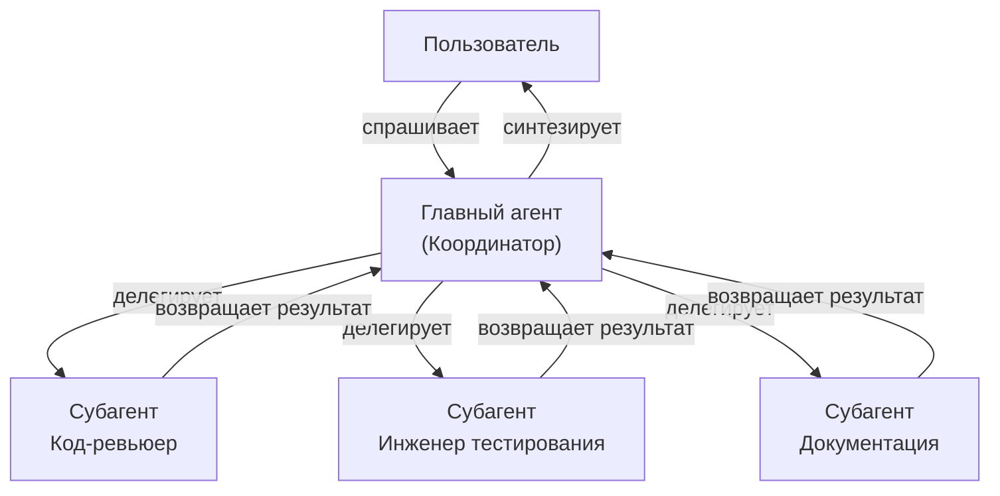

<picture>
  <source media="(prefers-color-scheme: dark)" srcset="../resources/logos/claude-howto-logo-dark.svg">
  
</picture>

# Субагенты — Полный справочник

Субагенты — специализированные ИИ-помощники, которым Claude Code может делегировать задачи. Каждый субагент имеет конкретное назначение, использует собственное контекстное окно, отдельное от основного разговора, и может быть настроен с конкретными инструментами и кастомным системным промптом.

## Содержание

1. [Обзор](#обзор)
2. [Ключевые преимущества](#ключевые-преимущества)
3. [Расположение файлов](#расположение-файлов)
4. [Конфигурация](#конфигурация)
5. [Встроенные субагенты](#встроенные-субагенты)
6. [Управление субагентами](#управление-субагентами)
7. [Использование субагентов](#использование-субагентов)
8. [Возобновляемые агенты](#возобновляемые-агенты)
9. [Цепочки субагентов](#цепочки-субагентов)
10. [Постоянная память для субагентов](#постоянная-память-для-субагентов)
11. [Фоновые субагенты](#фоновые-субагенты)
12. [Изоляция через Worktree](#изоляция-через-worktree)
13. [Ограничение порождаемых субагентов](#ограничение-порождаемых-субагентов)
14. [CLI-команда `claude agents`](#cli-команда-claude-agents)
15. [Команды агентов (Экспериментально)](#команды-агентов-экспериментально)
16. [Безопасность субагентов плагинов](#безопасность-субагентов-плагинов)
17. [Архитектура](#архитектура)
18. [Управление контекстом](#управление-контекстом)
19. [Когда использовать субагенты](#когда-использовать-субагенты)
20. [Лучшие практики](#лучшие-практики)
21. [Примеры субагентов в этой папке](#примеры-субагентов-в-этой-папке)
22. [Инструкции по установке](#инструкции-по-установке)
23. [Связанные концепции](#связанные-концепции)

---

## Обзор

Субагенты обеспечивают делегированное выполнение задач в Claude Code путём:

- Создания **изолированных ИИ-помощников** с отдельными контекстными окнами
- Предоставления **кастомных системных промптов** для специализированной экспертизы
- Применения **контроля доступа к инструментам** для ограничения возможностей
- Предотвращения **загрязнения контекста** от сложных задач
- Обеспечения **параллельного выполнения** нескольких специализированных задач

Каждый субагент работает независимо с чистого листа, получая только конкретный контекст, необходимый для его задачи, затем возвращая результаты главному агенту для синтеза.

**Быстрый старт**: Используй команду `/agents` для создания, просмотра, редактирования и управления субагентами в интерактивном режиме.

---

## Ключевые преимущества

| Преимущество | Описание |
|-------------|----------|
| **Сохранение контекста** | Работает в отдельном контексте, предотвращая загрязнение основного разговора |
| **Специализированная экспертиза** | Настроен для конкретных доменов с более высокими показателями успеха |
| **Переиспользуемость** | Использовать в разных проектах и делиться с командами |
| **Гибкие разрешения** | Разные уровни доступа к инструментам для разных типов субагентов |
| **Масштабируемость** | Несколько агентов работают над разными аспектами одновременно |

---

## Расположение файлов

Файлы субагентов можно хранить в нескольких местах с разными областями действия:

| Приоритет | Тип | Расположение | Область |
|----------|-----|-------------|---------|
| 1 (наивысший) | **CLI-определённые** | Через флаг `--agents` (JSON) | Только сессия |
| 2 | **Субагенты проекта** | `.claude/agents/` | Текущий проект |
| 3 | **Пользовательские субагенты** | `~/.claude/agents/` | Все проекты |
| 4 (наинизший) | **Агенты плагинов** | Директория `agents/` плагина | Через плагины |

При дублировании имён источники с более высоким приоритетом имеют преимущество.

---

## Конфигурация

### Формат файла

Субагенты определяются в YAML frontmatter с последующим системным промптом в Markdown:

```yaml
---
name: имя-субагента
description: Описание того, когда этот субагент должен вызываться
tools: tool1, tool2, tool3  # Необязательно — наследует все инструменты если пропущено
disallowedTools: tool4  # Необязательно — явно запрещённые инструменты
model: sonnet  # Необязательно — sonnet, opus, haiku, или inherit
permissionMode: default  # Необязательно — режим разрешений
maxTurns: 20  # Необязательно — лимит ходов агента
skills: skill1, skill2  # Необязательно — навыки для предварительной загрузки в контекст
mcpServers: server1  # Необязательно — MCP-серверы для субагента
memory: user  # Необязательно — область постоянной памяти (user, project, local)
background: false  # Необязательно — запускать как фоновую задачу
effort: high  # Необязательно — уровень рассуждений (low, medium, high, max)
isolation: worktree  # Необязательно — изоляция git worktree
initialPrompt: "Начни с анализа кодовой базы"  # Необязательно — первый автопромпт
hooks:  # Необязательно — хуки уровня компонента
  PreToolUse:
    - matcher: "Bash"
      hooks:
        - type: command
          command: "./scripts/security-check.sh"
---

Системный промпт субагента идёт здесь. Это может быть несколько абзацев
и должно чётко определять роль, возможности и подход субагента
к решению проблем.
```

### Поля конфигурации

| Поле | Обязательно | Описание |
|------|------------|---------|
| `name` | Да | Уникальный идентификатор (строчные буквы и дефисы) |
| `description` | Да | Описание назначения на естественном языке. Включи «use PROACTIVELY» для поощрения автоматического вызова |
| `tools` | Нет | Список конкретных инструментов. Пропусти для наследования всех инструментов. Поддерживает синтаксис `Agent(имя_агента)` |
| `disallowedTools` | Нет | Список инструментов, которые субагент не должен использовать |
| `model` | Нет | Модель: `sonnet`, `opus`, `haiku`, полный ID модели, или `inherit` |
| `permissionMode` | Нет | `default`, `acceptEdits`, `dontAsk`, `bypassPermissions`, `plan` |
| `maxTurns` | Нет | Максимальное количество ходов агента |
| `skills` | Нет | Список навыков для предварительной загрузки в контекст субагента при старте |
| `mcpServers` | Нет | MCP-серверы, доступные субагенту |
| `hooks` | Нет | Хуки уровня компонента (PreToolUse, PostToolUse, Stop) |
| `memory` | Нет | Область постоянной памяти: `user`, `project`, или `local` |
| `background` | Нет | Установить `true` для всегда запуска субагента как фоновой задачи |
| `effort` | Нет | Уровень рассуждений: `low`, `medium`, `high`, или `max` |
| `isolation` | Нет | Установить `worktree` для собственного git worktree субагента |
| `initialPrompt` | Нет | Автоматически отправляемый первый ход при запуске субагента как главного агента |

---

## Встроенные субагенты

Claude Code включает несколько встроенных субагентов, всегда доступных:

| Агент | Модель | Назначение |
|-------|-------|-----------|
| **general-purpose** | Наследует | Сложные, многошаговые задачи |
| **Plan** | Наследует | Исследование для режима планирования |
| **Explore** | Haiku | Исследование кодовой базы только для чтения (быстрое/среднее/очень тщательное) |
| **Bash** | Наследует | Команды терминала в отдельном контексте |
| **statusline-setup** | Sonnet | Настройка строки статуса |
| **Claude Code Guide** | Haiku | Ответы на вопросы о функциях Claude Code |

### Субагент Explore

| Свойство | Значение |
|---------|---------|
| **Модель** | Haiku (быстрый, низкая задержка) |
| **Режим** | Строго только для чтения |
| **Инструменты** | Glob, Grep, Read, Bash (только команды чтения) |
| **Назначение** | Быстрый поиск и анализ кодовой базы |

**Уровни тщательности** — Укажи глубину исследования:
- **«quick»** — Быстрые поиски с минимальным исследованием, хорошо для нахождения конкретных паттернов
- **«medium»** — Умеренное исследование, баланс скорости и тщательности, подход по умолчанию
- **«very thorough»** — Комплексный анализ в нескольких местах, может занять больше времени

---

## Управление субагентами

### Использование команды `/agents` (Рекомендуется)

```bash
/agents
```

Предоставляет интерактивное меню для:
- Просмотра всех доступных субагентов (встроенных, пользовательских и проектных)
- Создания новых субагентов с управляемой настройкой
- Редактирования существующих кастомных субагентов и доступа к инструментам
- Удаления кастомных субагентов
- Просмотра того, какие субагенты активны при наличии дублей

### Прямое управление файлами

```bash
# Создать субагент проекта
mkdir -p .claude/agents
cat > .claude/agents/test-runner.md << 'EOF'
---
name: test-runner
description: Использовать проактивно для запуска тестов и исправления сбоев
---

Ты эксперт по автоматизации тестирования. Когда видишь изменения кода,
проактивно запускай соответствующие тесты. Если тесты не проходят, анализируй
сбои и исправляй их, сохраняя исходное намерение тестов.
EOF

# Создать пользовательский субагент (доступен во всех проектах)
mkdir -p ~/.claude/agents
```

---

## Использование субагентов

### Автоматическое делегирование

Claude проактивно делегирует задачи на основе:
- Описания задачи в запросе
- Поля `description` в конфигурациях субагентов
- Текущего контекста и доступных инструментов

Для поощрения проактивного использования включи «use PROACTIVELY» или «MUST BE USED» в поле `description`:

```yaml
---
name: code-reviewer
description: Специалист по код-ревью. Использовать ПРОАКТИВНО после написания или изменения кода.
---
```

### Явный вызов

Можно явно запросить конкретный субагент:

```
> Используй субагент test-runner для исправления провальных тестов
> Попроси субагент code-reviewer проверить мои последние изменения
> Попроси субагент debugger расследовать эту ошибку
```

### Вызов через @-упоминание

Используй префикс `@` для гарантированного вызова конкретного субагента:

```
> @"code-reviewer (agent)" проверь модуль аутентификации
```

### Агент для всей сессии

Запусти всю сессию, используя конкретного агента как главного:

```bash
# Через CLI-флаг
claude --agent code-reviewer

# Через settings.json
{
  "agent": "code-reviewer"
}
```

---

## Возобновляемые агенты

Субагенты могут продолжать предыдущие разговоры с полным сохранением контекста:

```bash
# Первоначальный вызов
> Используй агент code-analyzer для начала анализа модуля аутентификации
# Возвращает agentId: "abc123"

# Возобновить агент позже
> Возобнови агент abc123 и теперь проанализируй также логику авторизации
```

**Сценарии использования**:
- Длительные исследования в нескольких сессиях
- Итеративная доработка без потери контекста
- Многошаговые рабочие процессы с сохранением контекста

---

## Цепочки субагентов

Выполняй несколько субагентов последовательно:

```bash
> Сначала используй субагент code-analyzer для нахождения проблем производительности,
  затем используй субагент optimizer для их исправления
```

Это позволяет строить сложные рабочие процессы, где вывод одного субагента поступает в другой.

---

## Постоянная память для субагентов

Поле `memory` даёт субагентам постоянную директорию, которая сохраняется между разговорами. Это позволяет субагентам накапливать знания со временем, храня заметки, результаты и контекст между сессиями.

### Области памяти

| Область | Директория | Сценарий использования |
|---------|-----------|----------------------|
| `user` | `~/.claude/agent-memory/<имя>/` | Личные заметки и предпочтения во всех проектах |
| `project` | `.claude/agent-memory/<имя>/` | Знания проекта, разделяемые с командой |
| `local` | `.claude/agent-memory-local/<имя>/` | Локальные знания проекта, не зафиксированные в системе контроля версий |

### Пример конфигурации

```yaml
---
name: researcher
memory: user
---

Ты исследовательский помощник. Используй директорию памяти для хранения результатов,
отслеживания прогресса между сессиями и накопления знаний со временем.

Проверяй файл MEMORY.md в начале каждой сессии для восстановления предыдущего контекста.
```

---

## Фоновые субагенты

Субагенты могут работать в фоновом режиме, освобождая основной разговор для других задач.

### Конфигурация

Установи `background: true` в frontmatter для всегда запуска субагента как фоновой задачи:

```yaml
---
name: long-runner
background: true
description: Выполняет долгие задачи анализа в фоновом режиме
---
```

### Горячие клавиши

| Клавиша | Действие |
|--------|---------|
| `Ctrl+B` | Перевести запущенную задачу субагента в фоновый режим |
| `Ctrl+F` | Завершить все фоновые агенты (нажать дважды для подтверждения) |

### Отключение фоновых задач

Установи переменную окружения для полного отключения поддержки фоновых задач:

```bash
export CLAUDE_CODE_DISABLE_BACKGROUND_TASKS=1
```

---

## Изоляция через Worktree

Настройка `isolation: worktree` даёт субагенту собственный git worktree, позволяя ему вносить изменения независимо, не затрагивая основное рабочее дерево.

### Конфигурация

```yaml
---
name: feature-builder
isolation: worktree
description: Реализует функции в изолированном git worktree
tools: Read, Write, Edit, Bash, Grep, Glob
---
```

### Как работает

- Субагент работает в собственном git worktree на отдельной ветке
- Если субагент не вносит изменений, worktree автоматически очищается
- При наличии изменений путь к worktree и имя ветки возвращаются главному агенту для проверки или слияния

---

## Ограничение порождаемых субагентов

Можно контролировать, какие субагенты данный субагент может порождать, используя синтаксис `Agent(тип_агента)` в поле `tools`. Это позволяет создать список разрешённых субагентов для делегирования.

### Пример

```yaml
---
name: coordinator
description: Координирует работу между специализированными агентами
tools: Agent(worker, researcher), Read, Bash
---

Ты агент-координатор. Можешь делегировать работу только субагентам «worker» и
«researcher». Используй Read и Bash для собственного исследования.
```

---

## CLI-команда `claude agents`

Команда `claude agents` выводит список всех настроенных агентов, сгруппированных по источнику (встроенные, пользовательского уровня, уровня проекта):

```bash
claude agents
```

---

## Команды агентов (Экспериментально)

Команды агентов координируют несколько экземпляров Claude Code, работающих вместе над сложными задачами. В отличие от субагентов (которым делегируются подзадачи с возвратом результатов), члены команды работают независимо с собственным контекстом.

> **Примечание**: Команды агентов экспериментальны и требуют Claude Code v2.1.32+.

### Субагенты vs Команды агентов

| Аспект | Субагенты | Команды агентов |
|--------|-----------|----------------|
| **Модель делегирования** | Родитель делегирует подзадачу, ждёт результата | Лидер команды назначает работу, члены выполняют независимо |
| **Контекст** | Свежий контекст для каждой подзадачи | Каждый член поддерживает свой постоянный контекст |
| **Координация** | Последовательно или параллельно | Общий список задач с управлением зависимостями |
| **Связь** | Только возвращаемые значения | Межагентные сообщения через почтовый ящик |
| **Лучше для** | Сфокусированные, чётко определённые подзадачи | Крупные многофайловые проекты, требующие параллельной работы |

### Включение команд агентов

```bash
export CLAUDE_CODE_EXPERIMENTAL_AGENT_TEAMS=1
```

### Запуск команды

После включения попроси Claude работать с членами команды в промпте:

```
Пользователь: Построй модуль аутентификации. Используй команду — один член для API-эндпоинтов,
              один для схемы БД, один для набора тестов.
```

Claude создаст команду, назначит задачи и автоматически скоординирует работу.

---

## Архитектура

### Высокоуровневая архитектура



---

## Когда использовать субагенты

| Сценарий | Рекомендация |
|---------|-------------|
| Задача требует специализированных знаний | ✅ Используй субагент с кастомным промптом |
| Задача может загрязнить основной контекст | ✅ Используй субагент с изолированным контекстом |
| Несколько независимых задач | ✅ Использовать параллельные субагенты |
| Задача требует ограниченных инструментов | ✅ Используй субагент с `tools:` списком |
| Задача требует записи файлов и безопасности | ✅ Используй субагент только для чтения |
| Простой, одношаговый запрос | ❌ Не нужен субагент |

---

## Лучшие практики

### Рекомендуется

- Делай описания конкретными и насыщенными триггерными словами
- Используй `disallowedTools` для принудительного соблюдения безопасности
- Начинай с малого и добавляй специализацию постепенно
- Версионно контролируй субагентов проекта в git
- Тестируй субагентов с простыми задачами перед сложными

### Не рекомендуется

- Не создавай субагентов для разовых задач
- Не давай субагентам больше инструментов, чем необходимо
- Не игнорируй поле `description`
- Не порождай субагентов без чёткого назначения

---

## Примеры субагентов в этой папке

| Файл | Назначение |
|------|-----------|
| `code-reviewer.md` | Комплексный анализ качества кода |
| `test-engineer.md` | Стратегия тестирования и покрытие |
| `documentation-writer.md` | Техническая документация |
| `secure-reviewer.md` | Ревью с фокусом на безопасность (только чтение) |
| `implementation-agent.md` | Полная реализация функций |
| `debugger.md` | Отладка и устранение ошибок |
| `data-scientist.md` | Анализ данных и статистика |
| `clean-code-reviewer.md` | Ревью чистого кода и рефакторинг |

---

## Инструкции по установке

```bash
# Создать директорию агентов проекта
mkdir -p .claude/agents

# Скопировать все примеры субагентов
cp 04-subagents/*.md .claude/agents/

# Или скопировать конкретные
cp 04-subagents/code-reviewer.md .claude/agents/
cp 04-subagents/test-engineer.md .claude/agents/
cp 04-subagents/secure-reviewer.md .claude/agents/

# Создать пользовательского субагента (все проекты)
cp 04-subagents/documentation-writer.md ~/.claude/agents/
```

После установки Claude автоматически делегирует соответствующим субагентам.

---

## Связанные концепции

- [Навыки](../03-skills/) — Авто-вызываемые возможности с инструкциями
- [Хуки](../06-hooks/) — Автоматизация по событиям
- [MCP](../05-mcp/) — Доступ к внешним инструментам и данным
- [Плагины](../07-plugins/) — Бандлированные коллекции агентов, команд, MCP
- [Расширенные возможности](../09-advanced-features/) — Режим планирования и другие продвинутые возможности

---

*Часть серии руководств [Claude How To](../)*
