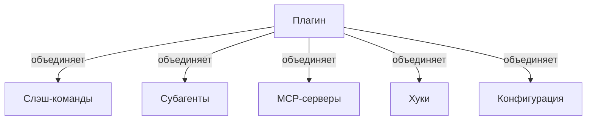

<picture>
  <source media="(prefers-color-scheme: dark)" srcset="../resources/logos/claude-howto-logo-dark.svg">
  
</picture>

# Плагины Claude Code

Эта папка содержит полные примеры плагинов, объединяющих несколько функций Claude Code в связные, устанавливаемые пакеты.

## Обзор

Плагины Claude Code — это связные коллекции кастомизаций (слэш-команды, субагенты, MCP-серверы и хуки), устанавливаемые одной командой. Они представляют механизм расширения высшего уровня — объединяют несколько функций в связные, распространяемые пакеты.

## Архитектура плагинов



## Типы и распространение плагинов

| Тип | Область | Доступен | Полномочия | Примеры |
|-----|---------|---------|-----------|--------|
| Официальный | Глобальный | Всем пользователям | Anthropic | PR Review, Security Guidance |
| Сообщества | Публичный | Всем пользователям | Сообщество | DevOps, Data Science |
| Организационный | Внутренний | Члены команды | Компания | Внутренние стандарты, инструменты |
| Личный | Индивидуальный | Один пользователь | Разработчик | Кастомные рабочие процессы |

## Структура определения плагина

Манифест плагина использует JSON-формат в `.claude-plugin/plugin.json`:

```json
{
  "name": "my-first-plugin",
  "description": "Плагин приветствия",
  "version": "1.0.0",
  "author": {
    "name": "Твоё имя"
  },
  "homepage": "https://example.com",
  "repository": "https://github.com/user/repo",
  "license": "MIT"
}
```

## Пример структуры плагина

```
my-plugin/
├── .claude-plugin/
│   └── plugin.json       # Манифест (название, описание, версия, автор)
├── commands/             # Навыки в виде Markdown-файлов
│   ├── task-1.md
│   ├── task-2.md
│   └── workflows/
├── agents/               # Определения кастомных агентов
│   ├── specialist-1.md
│   └── specialist-2.md
├── skills/               # Навыки агентов с файлами SKILL.md
│   ├── skill-1.md
│   └── skill-2.md
├── hooks/                # Обработчики событий в hooks.json
│   └── hooks.json
├── .mcp.json             # Конфигурации MCP-серверов
├── .lsp.json             # Конфигурации LSP-серверов
├── settings.json         # Настройки по умолчанию
├── templates/
│   └── issue-template.md
├── scripts/
│   ├── helper-1.sh
│   └── helper-2.py
└── docs/
    ├── README.md
    └── USAGE.md
```

## Конфигурация LSP-сервера

Плагины могут включать поддержку Language Server Protocol (LSP) для анализа кода в реальном времени. LSP-серверы обеспечивают диагностику, навигацию по коду и информацию о символах в процессе работы.

**Расположение конфигурации**:
- Файл `.lsp.json` в корне плагина
- Встроенный ключ `lsp` в `plugin.json`

### Примеры конфигураций

**Go (gopls)**:

```json
{
  "go": {
    "command": "gopls",
    "args": ["serve"],
    "extensionToLanguage": {
      ".go": "go"
    }
  }
}
```

**Python (pyright)**:

```json
{
  "python": {
    "command": "pyright-langserver",
    "args": ["--stdio"],
    "extensionToLanguage": {
      ".py": "python",
      ".pyi": "python"
    }
  }
}
```

**TypeScript**:

```json
{
  "typescript": {
    "command": "typescript-language-server",
    "args": ["--stdio"],
    "extensionToLanguage": {
      ".ts": "typescript",
      ".tsx": "typescriptreact",
      ".js": "javascript",
      ".jsx": "javascriptreact"
    }
  }
}
```

### Возможности LSP

После настройки LSP-серверы предоставляют:

- **Мгновенная диагностика** — ошибки и предупреждения появляются сразу после правок
- **Навигация по коду** — переход к определению, поиск ссылок, реализаций
- **Информация при наведении** — сигнатуры типов и документация
- **Список символов** — просмотр символов в текущем файле или рабочем пространстве

## Параметры плагина (v2.1.83+)

Плагины могут объявлять настраиваемые пользователем параметры в манифесте через `userConfig`. Значения с `sensitive: true` хранятся в системном хранилище ключей, а не в файлах настроек:

```json
{
  "name": "my-plugin",
  "version": "1.0.0",
  "userConfig": {
    "apiKey": {
      "description": "API-ключ для сервиса",
      "sensitive": true
    },
    "region": {
      "description": "Регион развёртывания",
      "default": "us-east-1"
    }
  }
}
```

## Постоянные данные плагина (`${CLAUDE_PLUGIN_DATA}`) (v2.1.78+)

Плагины имеют доступ к постоянной директории состояния через переменную окружения `${CLAUDE_PLUGIN_DATA}`. Эта директория уникальна для каждого плагина и сохраняется между сессиями:

```json
{
  "hooks": {
    "PostToolUse": [
      {
        "command": "node ${CLAUDE_PLUGIN_DATA}/track-usage.js"
      }
    ]
  }
}
```

## Настройки плагина

Плагины могут поставлять файл `settings.json` с конфигурацией по умолчанию. В настоящее время поддерживает ключ `agent`, который устанавливает агента основного потока для плагина:

```json
{
  "agent": "agents/specialist-1.md"
}
```

## Практические примеры

### Пример 1: Плагин PR Review

**Файл:** `.claude-plugin/plugin.json`

```json
{
  "name": "pr-review",
  "version": "1.0.0",
  "description": "Полный рабочий процесс ревью PR с проверками безопасности, тестирования и документации",
  "author": {
    "name": "Anthropic"
  },
  "repository": "https://github.com/anthropic/pr-review",
  "license": "MIT"
}
```

**Установка:**

```bash
/plugin install pr-review

# Результат:
# ✅ Установлено 3 слэш-команды
# ✅ Настроено 3 субагента
# ✅ Подключено 2 MCP-сервера
# ✅ Зарегистрировано 4 хука
# ✅ Готово к использованию!
```

### Пример 2: Плагин DevOps

**Компоненты:**

```
devops-automation/
├── commands/
│   ├── deploy.md
│   ├── rollback.md
│   ├── status.md
│   └── incident.md
├── agents/
│   ├── deployment-specialist.md
│   ├── incident-commander.md
│   └── alert-analyzer.md
├── hooks/
│   ├── pre-deploy.js
│   ├── post-deploy.js
│   └── on-error.js
└── scripts/
    ├── deploy.sh
    ├── rollback.sh
    └── health-check.sh
```

## Маркетплейс плагинов

Официальная директория плагинов Anthropic — `anthropics/claude-plugins-official`. Корпоративные администраторы также могут создавать приватные маркетплейсы плагинов.

### Конфигурация маркетплейса

| Настройка | Описание |
|---------|---------|
| `extraKnownMarketplaces` | Добавить дополнительные источники маркетплейсов |
| `strictKnownMarketplaces` | Управлять, какие маркетплейсы пользователи могут добавлять |
| `deniedPlugins` | Управляемый администратором список блокировки конкретных плагинов |

### Схема определения маркетплейса

Маркетплейсы плагинов определяются в `.claude-plugin/marketplace.json`:

```json
{
  "name": "my-team-plugins",
  "owner": "my-org",
  "plugins": [
    {
      "name": "code-standards",
      "source": "./plugins/code-standards",
      "description": "Применять командные стандарты кодирования",
      "version": "1.2.0",
      "author": "platform-team"
    }
  ]
}
```

### Типы источников плагинов

| Источник | Синтаксис | Пример |
|---------|-------|--------|
| **Относительный путь** | Строка пути | `"./plugins/my-plugin"` |
| **GitHub** | `{ "source": "github", "repo": "owner/repo" }` | `{ "source": "github", "repo": "acme/lint-plugin", "ref": "v1.0" }` |
| **Git URL** | `{ "source": "url", "url": "..." }` | `{ "source": "url", "url": "https://git.internal/plugin.git" }` |
| **npm** | `{ "source": "npm", "package": "..." }` | `{ "source": "npm", "package": "@acme/claude-plugin", "version": "^2.0" }` |
| **pip** | `{ "source": "pip", "package": "..." }` | `{ "source": "pip", "package": "claude-data-plugin", "version": ">=1.0" }` |

## Установка и жизненный цикл плагина

### Из маркетплейса

```bash
/plugin install plugin-name
# или через CLI:
claude plugin install plugin-name@marketplace-name
```

### Из GitHub

```bash
/plugin install github:username/repo
```

### Локальный плагин (для разработки)

```bash
# CLI-флаг для локального тестирования (можно повторять для нескольких плагинов)
claude --plugin-dir ./path/to/plugin
claude --plugin-dir ./plugin-a --plugin-dir ./plugin-b
```

### CLI-команды плагинов

```bash
claude plugin install <name>@<marketplace>   # Установить из маркетплейса
claude plugin uninstall <name>               # Удалить плагин
claude plugin list                           # Список установленных плагинов
claude plugin enable <name>                  # Включить отключённый плагин
claude plugin disable <name>                 # Отключить плагин
claude plugin validate                       # Проверить структуру плагина
```

## Горячая перезагрузка

Плагины поддерживают горячую перезагрузку при разработке. Принудительная перезагрузка:

```bash
/reload-plugins
```

Это повторно считывает все манифесты плагинов, команды, агенты, навыки, хуки и конфигурации MCP/LSP без перезапуска сессии.

## Сравнение функций плагинов

| Функция | Слэш-команда | Навык | Субагент | Плагин |
|---------|-------------|-------|---------|-------|
| **Установка** | Ручное копирование | Ручное копирование | Ручная конфигурация | Одна команда |
| **Время настройки** | 5 минут | 10 минут | 15 минут | 2 минуты |
| **Бандлинг** | Один файл | Один файл | Один файл | Несколько |
| **Версионирование** | Вручную | Вручную | Вручную | Автоматически |
| **Обмен в команде** | Копировать файл | Копировать файл | Копировать файл | ID установки |
| **Маркетплейс** | Нет | Нет | Нет | Да |

## Лучшие практики

### Рекомендуется ✅

- Использовать чёткие, описательные имена плагинов
- Включать полный README
- Правильно версионировать (semver)
- Тестировать все компоненты вместе
- Чётко документировать требования
- Приводить примеры использования
- Поддерживать обратную совместимость
- Держать плагины сфокусированными и связными

### Не рекомендуется ❌

- Не объединять несвязанные функции
- Не жёстко кодировать учётные данные
- Не пропускать тестирование
- Не забывать документацию
- Не создавать избыточные плагины
- Не игнорировать версионирование

## Устранение неполадок

### Плагин не устанавливается

- Проверить совместимость версии Claude Code: `/version`
- Проверить синтаксис `plugin.json` валидатором JSON
- Проверить интернет-соединение (для удалённых плагинов)

### Компоненты не загружаются

- Проверить, что пути в `plugin.json` соответствуют структуре директорий
- Проверить права файлов: `chmod +x scripts/`
- Проверить синтаксис файлов компонентов

### Команды недоступны после установки

- Убедиться, что плагин успешно установлен: `/plugin list --installed`
- Проверить, включён ли плагин: `/plugin status plugin-name`
- Перезапустить Claude Code

## Связанные концепции

- **[Слэш-команды](../01-slash-commands/)** — Отдельные команды, объединяемые в плагинах
- **[Память](../02-memory/)** — Постоянный контекст для плагинов
- **[Навыки](../03-skills/)** — Доменная экспертиза, оборачиваемая в плагины
- **[Субагенты](../04-subagents/)** — Специализированные агенты в компонентах плагина
- **[MCP-серверы](../05-mcp/)** — MCP-интеграции, объединяемые в плагинах
- **[Хуки](../06-hooks/)** — Обработчики событий для рабочих процессов плагина

## Дополнительные ресурсы

- [Официальная документация по плагинам](https://code.claude.com/docs/en/plugins)
- [Найти плагины](https://code.claude.com/docs/en/discover-plugins)
- [Маркетплейсы плагинов](https://code.claude.com/docs/en/plugin-marketplaces)
- [Справочник плагинов](https://code.claude.com/docs/en/plugins-reference)

---

*Часть серии руководств [Claude How To](../)*
