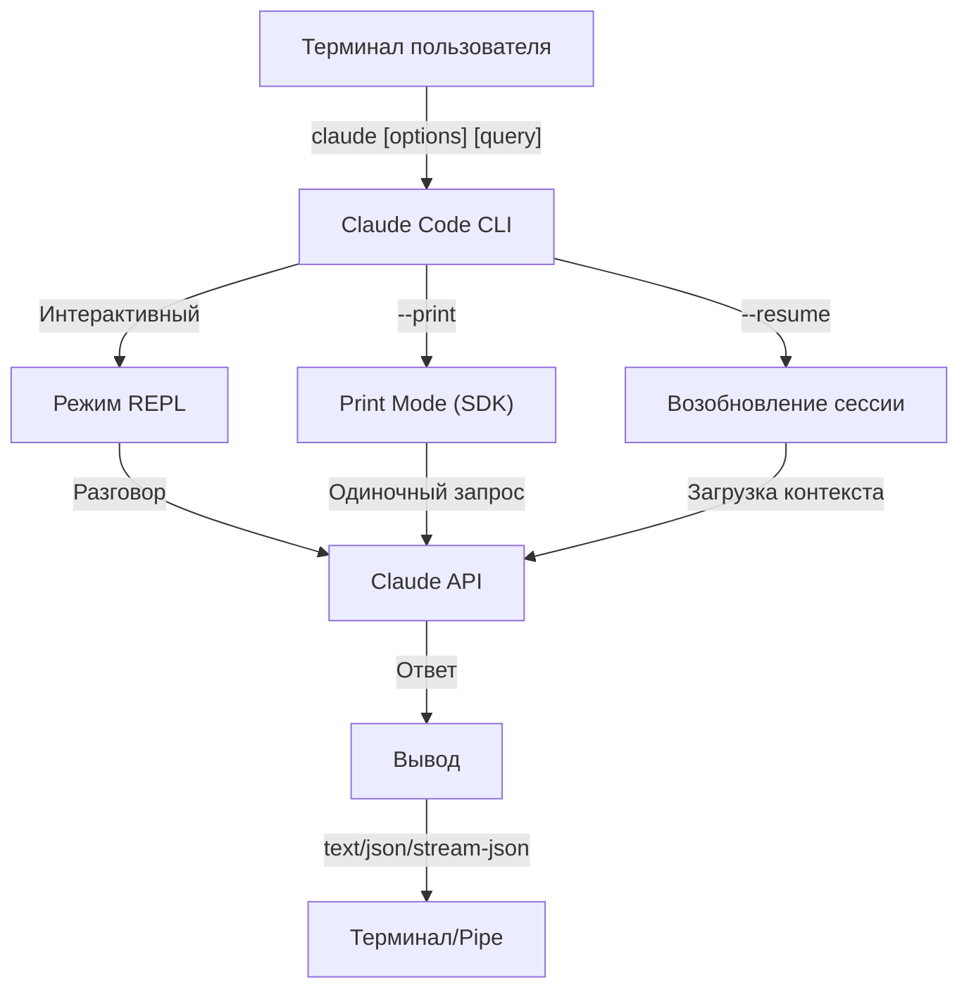

<picture>
  <source media="(prefers-color-scheme: dark)" srcset="../resources/logos/claude-howto-logo-dark.svg">
  
</picture>

# Справочник CLI

## Обзор

Claude Code CLI (Command Line Interface) — основной способ взаимодействия с Claude Code. Он предоставляет мощные опции для выполнения запросов, управления сессиями, настройки моделей и интеграции Claude в рабочие процессы разработки.

## Архитектура



## CLI-команды

| Команда | Описание | Пример |
|---------|---------|--------|
| `claude` | Запустить интерактивный REPL | `claude` |
| `claude "запрос"` | Запустить REPL с начальным промптом | `claude "объясни этот проект"` |
| `claude -p "запрос"` | Print Mode — запрос и выход | `claude -p "объясни эту функцию"` |
| `cat file \| claude -p "запрос"` | Обработать переданный контент | `cat logs.txt \| claude -p "объясни"` |
| `claude -c` | Продолжить последний разговор | `claude -c` |
| `claude -c -p "запрос"` | Продолжить в print mode | `claude -c -p "проверь на ошибки типов"` |
| `claude -r "<сессия>" "запрос"` | Возобновить сессию по ID или имени | `claude -r "auth-refactor" "заверши этот PR"` |
| `claude update` | Обновить до последней версии | `claude update` |
| `claude mcp` | Настроить MCP-серверы | См. [документацию MCP](../05-mcp/) |
| `claude mcp serve` | Запустить Claude Code как MCP-сервер | `claude mcp serve` |
| `claude agents` | Список всех настроенных субагентов | `claude agents` |
| `claude auto-mode defaults` | Вывести правила автоматического режима как JSON | `claude auto-mode defaults` |
| `claude remote-control` | Запустить сервер удалённого управления | `claude remote-control` |
| `claude plugin` | Управлять плагинами (установка, включение, отключение) | `claude plugin install my-plugin` |
| `claude auth login` | Войти в систему | `claude auth login --email user@example.com` |
| `claude auth logout` | Выйти из текущего аккаунта | `claude auth logout` |
| `claude auth status` | Проверить статус аутентификации | `claude auth status` |

## Основные флаги

| Флаг | Описание | Пример |
|------|---------|--------|
| `-p, --print` | Вывести ответ без интерактивного режима | `claude -p "запрос"` |
| `-c, --continue` | Загрузить последний разговор | `claude --continue` |
| `-r, --resume` | Возобновить конкретную сессию по ID или имени | `claude --resume auth-refactor` |
| `-v, --version` | Вывести номер версии | `claude -v` |
| `-w, --worktree` | Запустить в изолированном git worktree | `claude -w` |
| `-n, --name` | Отображаемое имя сессии | `claude -n "auth-refactor"` |
| `--from-pr <number>` | Возобновить сессии, связанные с GitHub PR | `claude --from-pr 42` |
| `--remote "задача"` | Создать веб-сессию на claude.ai | `claude --remote "реализовать API"` |
| `--remote-control, --rc` | Интерактивная сессия с удалённым управлением | `claude --rc` |
| `--teleport` | Возобновить веб-сессию локально | `claude --teleport` |
| `--teammate-mode` | Режим отображения команды агентов | `claude --teammate-mode tmux` |
| `--bare` | Минимальный режим (без хуков, навыков, плагинов, MCP) | `claude --bare` |
| `--enable-auto-mode` | Разблокировать авторежим | `claude --enable-auto-mode` |
| `--channels` | Подписаться на MCP-каналы | `claude --channels discord,telegram` |
| `--chrome` / `--no-chrome` | Включить/отключить интеграцию с Chrome | `claude --chrome` |
| `--effort` | Установить уровень рассуждений | `claude --effort high` |
| `--init` / `--init-only` | Запустить хуки инициализации | `claude --init` |
| `--maintenance` | Запустить хуки обслуживания и выйти | `claude --maintenance` |
| `--disable-slash-commands` | Отключить все навыки и слэш-команды | `claude --disable-slash-commands` |
| `--no-session-persistence` | Отключить сохранение сессий (print mode) | `claude -p --no-session-persistence "запрос"` |

## Интерактивный vs Print Mode

**Интерактивный режим** (по умолчанию):
```bash
# Запустить интерактивную сессию
claude

# Запустить с начальным промптом
claude "объясни процесс аутентификации"
```

**Print Mode** (неинтерактивный):
```bash
# Одиночный запрос и выход
claude -p "что делает эта функция?"

# Обработать содержимое файла
cat error.log | claude -p "объясни эту ошибку"

# Цепочка с другими инструментами
claude -p "список задач" | grep "СРОЧНО"
```

## Модели и конфигурация

| Флаг | Описание | Пример |
|------|---------|--------|
| `--model` | Установить модель (sonnet, opus, haiku, или полное имя) | `claude --model opus` |
| `--fallback-model` | Автоматический запасной вариант при перегрузке | `claude -p --fallback-model sonnet "запрос"` |
| `--agent` | Указать агента для сессии | `claude --agent my-custom-agent` |
| `--agents` | Определить кастомных субагентов через JSON | |
| `--effort` | Установить уровень усилий (low, medium, high, max) | `claude --effort high` |

### Примеры выбора модели

```bash
# Opus 4.6 для сложных задач
claude --model opus "разработать стратегию кэширования"

# Haiku 4.5 для быстрых задач
claude --model haiku -p "отформатировать этот JSON"

# С запасным вариантом для надёжности
claude -p --model opus --fallback-model sonnet "проанализировать архитектуру"

# opusplan (Opus планирует, Sonnet выполняет)
claude --model opusplan "спроектируй и реализуй уровень кэширования"
```

## Кастомизация системного промпта

| Флаг | Описание | Пример |
|------|---------|--------|
| `--system-prompt` | Заменить весь промпт по умолчанию | `claude --system-prompt "Ты эксперт по Python"` |
| `--system-prompt-file` | Загрузить промпт из файла (только print mode) | `claude -p --system-prompt-file ./prompt.txt "запрос"` |
| `--append-system-prompt` | Добавить к промпту по умолчанию | `claude --append-system-prompt "Всегда использовать TypeScript"` |

### Примеры системных промптов

```bash
# Полная кастомная персона
claude --system-prompt "Ты старший инженер по безопасности. Фокусируйся на уязвимостях."

# Добавить конкретные инструкции
claude --append-system-prompt "Всегда включай модульные тесты с примерами кода"

# Загрузить сложный промпт из файла
claude -p --system-prompt-file ./prompts/code-reviewer.txt "проверь main.py"
```

## Управление инструментами и разрешениями

| Флаг | Описание | Пример |
|------|---------|--------|
| `--tools` | Ограничить доступные встроенные инструменты | `claude -p --tools "Bash,Edit,Read" "запрос"` |
| `--allowedTools` | Инструменты, выполняемые без запроса | `"Bash(git log:*)" "Read"` |
| `--disallowedTools` | Инструменты, удалённые из контекста | `"Bash(rm:*)" "Edit"` |
| `--dangerously-skip-permissions` | Пропустить все запросы разрешений | `claude --dangerously-skip-permissions` |
| `--permission-mode` | Начать в указанном режиме разрешений | `claude --permission-mode auto` |
| `--enable-auto-mode` | Разблокировать авторежим | `claude --enable-auto-mode` |

### Примеры разрешений

```bash
# Режим только для чтения для ревью кода
claude --permission-mode plan "проверь эту кодовую базу"

# Ограничить безопасными инструментами
claude --tools "Read,Grep,Glob" -p "найти все комментарии TODO"

# Разрешить конкретные git-команды без запросов
claude --allowedTools "Bash(git status:*)" "Bash(git log:*)"

# Заблокировать опасные операции
claude --disallowedTools "Bash(rm -rf:*)" "Bash(git push --force:*)"
```

## Формат вывода

| Флаг | Описание | Параметры | Пример |
|------|---------|----------|--------|
| `--output-format` | Указать формат вывода (print mode) | `text`, `json`, `stream-json` | `claude -p --output-format json "запрос"` |
| `--input-format` | Указать формат ввода (print mode) | `text`, `stream-json` | `claude -p --input-format stream-json` |
| `--verbose` | Включить подробное логирование | | `claude --verbose` |
| `--json-schema` | Получить валидированный JSON по схеме | | `claude -p --json-schema '{"type":"object"}' "запрос"` |
| `--max-budget-usd` | Максимальный расход для print mode | | `claude -p --max-budget-usd 5.00 "запрос"` |

### Примеры форматов вывода

```bash
# Обычный текст (по умолчанию)
claude -p "объясни этот код"

# JSON для программного использования
claude -p --output-format json "список всех функций в main.py"

# Потоковый JSON для обработки в реальном времени
claude -p --output-format stream-json "сгенерировать длинный отчёт"

# Структурированный вывод с валидацией схемы
claude -p --json-schema '{"type":"object","properties":{"bugs":{"type":"array"}}}' \
  "найти баги в этом коде и вернуть как JSON"
```

## Рабочее пространство и директории

| Флаг | Описание | Пример |
|------|---------|--------|
| `--add-dir` | Добавить дополнительные рабочие директории | `claude --add-dir ../apps ../lib` |
| `--setting-sources` | Источники настроек через запятую | `claude --setting-sources user,project` |
| `--settings` | Загрузить настройки из файла или JSON | `claude --settings ./settings.json` |
| `--plugin-dir` | Загрузить плагины из директории | `claude --plugin-dir ./my-plugin` |

## Управление сессиями

```bash
# Продолжить последний разговор
claude -c

# Возобновить именованную сессию
claude -r "feature-auth" "продолжить реализацию логина"

# Создать ответвление для экспериментов
claude --resume feature-auth --fork-session "попробовать альтернативный подход"

# Использовать конкретный ID сессии
claude --session-id "550e8400-e29b-41d4-a716-446655440000" "продолжить"
```

## Конфигурация агентов

Флаг `--agents` принимает JSON-объект с определениями кастомных субагентов для сессии.

```json
{
  "agent-name": {
    "description": "Обязательно: когда вызывать этого агента",
    "prompt": "Обязательно: системный промпт для агента",
    "tools": ["Необязательно", "массив", "инструментов"],
    "model": "необязательно: sonnet|opus|haiku"
  }
}
```

### Пример конфигурации агентов

```json
{
  "code-reviewer": {
    "description": "Эксперт по ревью кода. Использовать проактивно после изменений кода.",
    "prompt": "Ты старший ревьюер кода. Фокусируйся на качестве, безопасности и лучших практиках.",
    "tools": ["Read", "Grep", "Glob", "Bash"],
    "model": "sonnet"
  },
  "debugger": {
    "description": "Специалист по отладке ошибок и сбоев тестов.",
    "prompt": "Ты эксперт по отладке. Анализируй ошибки, определяй причины и предлагай исправления.",
    "tools": ["Read", "Edit", "Bash", "Grep"],
    "model": "opus"
  }
}
```

## Ценные сценарии использования

### 1. Интеграция CI/CD

```yaml
name: AI Code Review
on: [pull_request]
jobs:
  review:
    runs-on: ubuntu-latest
    steps:
      - uses: actions/checkout@v4
      - name: Install Claude Code
        run: npm install -g @anthropic-ai/claude-code
      - name: Run Code Review
        env:
          ANTHROPIC_API_KEY: ${{ secrets.ANTHROPIC_API_KEY }}
        run: |
          claude -p --output-format json \
            --max-turns 1 \
            "Проверь изменения в этом PR на наличие проблем безопасности и качества" > review.json
```

### 2. Обработка через pipe

```bash
# Анализ логов ошибок
tail -1000 /var/log/app/error.log | claude -p "обобщи эти ошибки и предложи исправления"

# Ревью конкретного файла
cat src/auth.ts | claude -p "проверь этот код аутентификации на проблемы безопасности"

# Генерация документации
cat src/api/*.ts | claude -p "сгенерировать API-документацию в markdown"
```

### 3. Пакетная обработка

```bash
# Обработать несколько файлов
for file in src/*.ts; do
  echo "Обрабатываю $file..."
  claude -p --model haiku "кратко о файле: $(cat $file)" >> summaries.md
done
```

### 4. Интеграция JSON API

```bash
# Получить структурированный анализ
claude -p --output-format json \
  --json-schema '{"type":"object","properties":{"functions":{"type":"array"}}}' \
  "проанализировать main.py и вернуть список функций"

# Обработать вывод с jq
claude -p --output-format json "список всех API-эндпоинтов" | jq '.endpoints[]'
```

## Модели

| Модель | ID | Контекстное окно | Примечания |
|--------|-----|-----------------|-----------|
| Opus 4.6 | `claude-opus-4-6` | 1M токенов | Наиболее мощная, адаптивные уровни усилий |
| Sonnet 4.6 | `claude-sonnet-4-6` | 1M токенов | Баланс скорости и возможностей |
| Haiku 4.5 | `claude-haiku-4-5` | 1M токенов | Самая быстрая, лучше для быстрых задач |

## Ключевые переменные окружения

| Переменная | Описание |
|-----------|---------|
| `ANTHROPIC_API_KEY` | API-ключ для аутентификации |
| `ANTHROPIC_MODEL` | Переопределить модель по умолчанию |
| `MAX_THINKING_TOKENS` | Установить бюджет токенов расширенного мышления |
| `CLAUDE_CODE_EFFORT_LEVEL` | Установить уровень усилий (`low`/`medium`/`high`/`max`) |
| `CLAUDE_CODE_SIMPLE` | Минимальный режим, устанавливается флагом `--bare` |
| `CLAUDE_CODE_DISABLE_AUTO_MEMORY` | Отключить автообновления CLAUDE.md |
| `CLAUDE_CODE_DISABLE_BACKGROUND_TASKS` | Отключить фоновые задачи |
| `CLAUDE_CODE_DISABLE_CRON` | Отключить запланированные задачи |
| `CLAUDE_CODE_EXPERIMENTAL_AGENT_TEAMS` | Включить экспериментальные команды агентов |
| `ENABLE_TOOL_SEARCH` | Включить поиск инструментов |
| `MAX_MCP_OUTPUT_TOKENS` | Максимальные токены для вывода MCP |

## Быстрый справочник

### Наиболее частые команды

```bash
# Интерактивная сессия
claude

# Быстрый вопрос
claude -p "как мне..."

# Продолжить разговор
claude -c

# Обработать файл
cat file.py | claude -p "проверь это"

# JSON вывод для скриптов
claude -p --output-format json "запрос"
```

### Комбинации флагов

| Сценарий использования | Команда |
|----------------------|---------|
| Быстрое ревью кода | `cat file \| claude -p "review"` |
| Структурированный вывод | `claude -p --output-format json "запрос"` |
| Безопасное исследование | `claude --permission-mode plan` |
| Автономно с безопасностью | `claude --enable-auto-mode --permission-mode auto` |
| Интеграция CI/CD | `claude -p --max-turns 3 --output-format json` |
| Возобновление работы | `claude -r "имя-сессии"` |
| Кастомная модель | `claude --model opus "сложная задача"` |
| Минимальный режим | `claude --bare "быстрый запрос"` |

## Устранение неполадок

### Команда не найдена

**Проблема:** `claude: command not found`

**Решения:**
- Установить Claude Code: `npm install -g @anthropic-ai/claude-code`
- Проверить, что PATH включает директорию npm global bin
- Попробовать с полным путём: `npx claude`

### Проблемы с API-ключом

**Проблема:** Аутентификация не удалась

**Решения:**
- Установить API-ключ: `export ANTHROPIC_API_KEY=твой-ключ`
- Проверить, что ключ действителен и имеет достаточно кредитов
- Проверить разрешения ключа для запрошенной модели

### Проблемы с форматом вывода

**Проблема:** JSON вывод искажён

**Решения:**
- Использовать `--json-schema` для принудительной структуры
- Добавить явные JSON-инструкции в промпт
- Использовать `--output-format json` (а не просить JSON в промпте)

---

## Дополнительные ресурсы

- **[Официальный справочник CLI](https://code.claude.com/docs/en/cli-reference)** — Полный справочник команд
- **[Документация безголового режима](https://code.claude.com/docs/en/headless)** — Автоматизированное выполнение
- **[Слэш-команды](../01-slash-commands/)** — Кастомные ярлыки внутри Claude
- **[Руководство по памяти](../02-memory/)** — Постоянный контекст через CLAUDE.md
- **[Протокол MCP](../05-mcp/)** — Интеграции внешних инструментов
- **[Расширенные возможности](../09-advanced-features/)** — Режим планирования, расширенное мышление
- **[Руководство по субагентам](../04-subagents/)** — Делегированное выполнение задач

---

*Часть серии руководств [Claude How To](../)*
