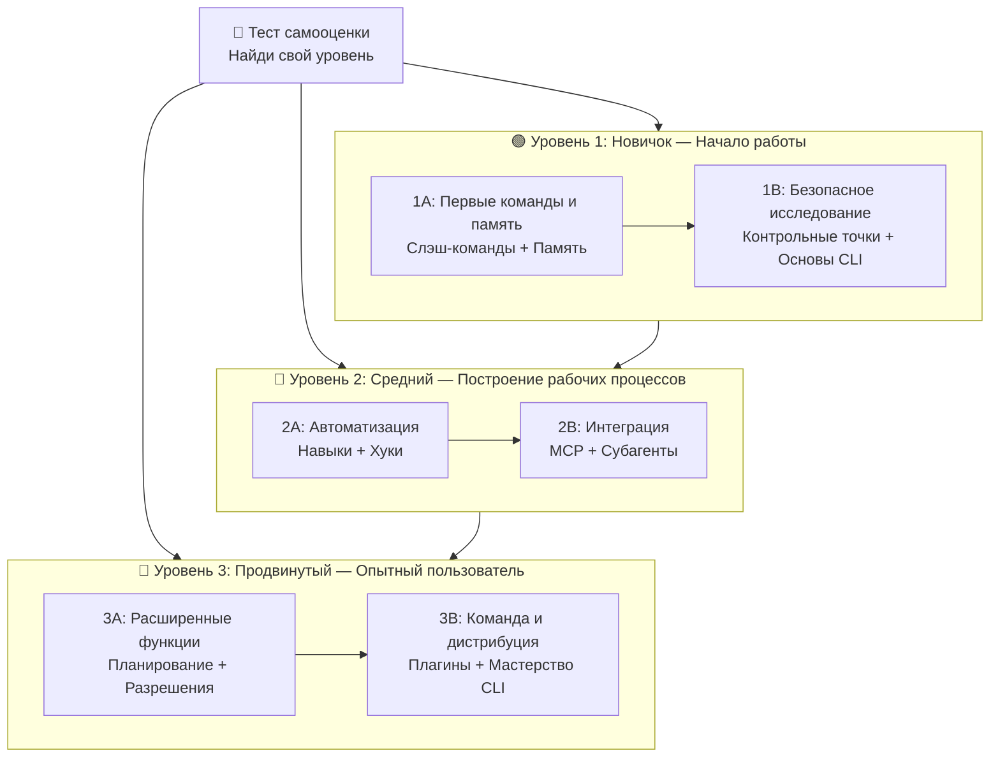

<picture>
  <source media="(prefers-color-scheme: dark)" srcset="resources/logos/claude-howto-logo-dark.svg">
  
</picture>

# 📚 Дорожная карта обучения Claude Code

**Только начинаете работу с Claude Code?** Это руководство поможет вам освоить функции Claude Code в своём темпе. Независимо от того, являетесь ли вы полным новичком или опытным разработчиком, начните с самооценки ниже, чтобы найти правильный путь.

---

## 🧭 Определите свой уровень

Не все начинают с одинаковой точки. Пройдите быструю самооценку, чтобы найти правильную отправную точку.

**Ответьте честно на эти вопросы:**

- [ ] Я умею запускать Claude Code и вести разговор (`claude`)
- [ ] Я создавал или редактировал файл CLAUDE.md
- [ ] Я использовал как минимум 3 встроенные слэш-команды (например, /help, /compact, /model)
- [ ] Я создавал кастомную слэш-команду или навык (SKILL.md)
- [ ] Я настраивал MCP-сервер (например, GitHub, база данных)
- [ ] Я настраивал хуки в ~/.claude/settings.json
- [ ] Я создавал или использовал кастомных субагентов (.claude/agents/)
- [ ] Я использовал print mode (`claude -p`) для скриптинга или CI/CD

**Ваш уровень:**

| Отметок | Уровень | Начало | Время прохождения |
|---------|---------|--------|------------------|
| 0-2 | **Уровень 1: Новичок** — Начало работы | [Этап 1A](#этап-1a-первые-команды--память) | ~3 часа |
| 3-5 | **Уровень 2: Средний** — Построение рабочих процессов | [Этап 2A](#этап-2a-автоматизация-навыки--хуки) | ~5 часов |
| 6-8 | **Уровень 3: Продвинутый** — Опытный пользователь и тимлид | [Этап 3A](#этап-3a-расширенные-возможности) | ~5 часов |

> **Совет**: При неуверенности начните на уровень ниже. Лучше быстро просмотреть знакомый материал, чем пропустить фундаментальные концепции.

> **Интерактивная версия**: Запустите `/self-assessment` в Claude Code для интерактивного теста, который оценивает вашу компетентность по всем 10 областям функций и создаёт персонализированный учебный план.

---

## 🎯 Философия обучения

Папки в этом репозитории пронумерованы в **рекомендованном порядке обучения** на основе трёх ключевых принципов:

1. **Зависимости** — Сначала базовые концепции
2. **Сложность** — Более простые функции перед продвинутыми
3. **Частота использования** — Наиболее распространённые функции изучаются в первую очередь

Такой подход обеспечивает создание прочной основы при получении немедленной пользы для производительности.

---

## 🗺️ Ваш учебный путь



---

## 📊 Полная таблица дорожной карты

| Шаг | Функция | Сложность | Время | Уровень | Зависимости | Зачем изучать | Ключевые преимущества |
|-----|---------|----------|-------|---------|-------------|---------------|----------------------|
| **1** | [Слэш-команды](01-slash-commands/) | ⭐ Новичок | 30 мин | Уровень 1 | Нет | Быстрый прирост производительности (55+ встроенных + 5 навыков) | Мгновенная автоматизация |
| **2** | [Память](02-memory/) | ⭐⭐ Новичок+ | 45 мин | Уровень 1 | Нет | Необходима для всех функций | Постоянный контекст |
| **3** | [Контрольные точки](08-checkpoints/) | ⭐⭐ Средний | 45 мин | Уровень 1 | Управление сессиями | Безопасное исследование | Эксперименты, восстановление |
| **4** | [Основы CLI](10-cli/) | ⭐⭐ Новичок+ | 30 мин | Уровень 1 | Нет | Базовое использование CLI | Интерактивный и print mode |
| **5** | [Навыки](03-skills/) | ⭐⭐ Средний | 1 час | Уровень 2 | Слэш-команды | Автоматическая экспертиза | Повторно используемые возможности |
| **6** | [Хуки](06-hooks/) | ⭐⭐ Средний | 1 час | Уровень 2 | Инструменты, команды | Автоматизация рабочих процессов | Валидация, контроль качества |
| **7** | [MCP](05-mcp/) | ⭐⭐⭐ Средний+ | 1 час | Уровень 2 | Конфигурация | Доступ к живым данным | Интеграция в реальном времени |
| **8** | [Субагенты](04-subagents/) | ⭐⭐⭐ Средний+ | 1.5 часа | Уровень 2 | Память, команды | Обработка сложных задач | Делегирование, специализированная экспертиза |
| **9** | [Расширенные возможности](09-advanced-features/) | ⭐⭐⭐⭐⭐ Продвинутый | 2-3 часа | Уровень 3 | Все предыдущие | Инструменты опытного пользователя | Планирование, авторежим, каналы |
| **10** | [Плагины](07-plugins/) | ⭐⭐⭐⭐ Продвинутый | 2 часа | Уровень 3 | Все предыдущие | Полные решения | Введение в команду, дистрибуция |
| **11** | [Мастерство CLI](10-cli/) | ⭐⭐⭐ Продвинутый | 1 час | Уровень 3 | Все рекомендуемые | Мастерство командной строки | Скриптинг, CI/CD |

**Общее время обучения**: ~11-13 часов (или сразу к своему уровню)

---

## 🟢 Уровень 1: Новичок — Начало работы

**Для**: Пользователей с 0-2 отметками в тесте
**Время**: ~3 часа
**Фокус**: Немедленная производительность, понимание основ
**Результат**: Комфортный ежедневный пользователь, готовый к уровню 2

### Этап 1A: Первые команды & Память

**Темы**: Слэш-команды + Память
**Время**: 1-2 часа
**Сложность**: ⭐ Новичок
**Цель**: Немедленный прирост производительности с кастомными командами и постоянным контекстом

#### Что вы достигнете
✅ Создать кастомные слэш-команды для повторяющихся задач
✅ Настроить память проекта для командных стандартов
✅ Настроить личные предпочтения
✅ Понять, как Claude загружает контекст автоматически

#### Практические упражнения

```bash
# Упражнение 1: Установить первую слэш-команду
mkdir -p .claude/commands
cp 01-slash-commands/optimize.md .claude/commands/

# Упражнение 2: Создать память проекта
cp 02-memory/project-CLAUDE.md ./CLAUDE.md

# Упражнение 3: Попробовать
# В Claude Code введите: /optimize
```

#### Критерии успеха
- [ ] Успешно вызвана команда `/optimize`
- [ ] Claude помнит стандарты проекта из CLAUDE.md
- [ ] Понимание, когда использовать слэш-команды vs. память

#### Следующие шаги
- Прочитать: [01-slash-commands/README.ru.md](01-slash-commands/README.ru.md)
- Прочитать: [02-memory/README.ru.md](02-memory/README.ru.md)

> **Проверьте своё понимание**: Запустите `/lesson-quiz slash-commands` или `/lesson-quiz memory` в Claude Code.

---

### Этап 1B: Безопасное исследование

**Темы**: Контрольные точки + Основы CLI
**Время**: 1 час
**Сложность**: ⭐⭐ Новичок+
**Цель**: Научиться безопасно экспериментировать и использовать основные CLI-команды

#### Что вы достигнете
✅ Создавать и восстанавливать контрольные точки
✅ Понять интерактивный vs. print mode
✅ Использовать основные флаги CLI
✅ Обрабатывать файлы через pipe

#### Практические упражнения

```bash
# Упражнение 1: Попробовать рабочий процесс с контрольными точками
# В Claude Code: внесите изменения, затем нажмите Esc+Esc или используйте /rewind

# Упражнение 2: Интерактивный vs Print mode
claude "объясни этот проект"           # Интерактивный режим
claude -p "объясни эту функцию"        # Print mode (неинтерактивный)

# Упражнение 3: Обработать содержимое файла через pipe
cat error.log | claude -p "объясни эту ошибку"
```

#### Следующие шаги
- Прочитать: [08-checkpoints/README.ru.md](08-checkpoints/README.ru.md)
- Прочитать: [10-cli/README.ru.md](10-cli/README.ru.md)
- **Готовы к уровню 2!** Переходите к [Этапу 2A](#этап-2a-автоматизация-навыки--хуки)

---

## 🔵 Уровень 2: Средний — Построение рабочих процессов

**Для**: Пользователей с 3-5 отметками в тесте
**Время**: ~5 часов
**Фокус**: Автоматизация, интеграция, делегирование задач
**Результат**: Автоматизированные рабочие процессы, внешние интеграции, готовность к уровню 3

### Проверка предварительных требований

Убедитесь, что вы освоили концепции уровня 1:

- [ ] Умеете создавать и использовать слэш-команды ([01-slash-commands/](01-slash-commands/))
- [ ] Настроили память проекта через CLAUDE.md ([02-memory/](02-memory/))
- [ ] Знаете, как создавать и восстанавливать контрольные точки ([08-checkpoints/](08-checkpoints/))
- [ ] Умеете использовать `claude` и `claude -p` из командной строки ([10-cli/](10-cli/))

---

### Этап 2A: Автоматизация (Навыки + Хуки)

**Темы**: Навыки + Хуки
**Время**: 2-3 часа
**Сложность**: ⭐⭐ Средний
**Цель**: Автоматизировать общие рабочие процессы и контроль качества

#### Что вы достигнете
✅ Автоматически вызывать специализированные возможности с YAML-frontmatter
✅ Настроить событийную автоматизацию с 25 событиями хуков
✅ Использовать все 4 типа хуков (command, http, prompt, agent)
✅ Применять стандарты качества кода

#### Практические упражнения

```bash
# Упражнение 1: Установить навык
cp -r 03-skills/code-review ~/.claude/skills/

# Упражнение 2: Настроить хуки
mkdir -p ~/.claude/hooks
cp 06-hooks/pre-tool-check.sh ~/.claude/hooks/
chmod +x ~/.claude/hooks/pre-tool-check.sh

# Упражнение 3: Настроить хуки в settings.json
# Добавить в ~/.claude/settings.json:
{
  "hooks": {
    "PreToolUse": [
      {
        "matcher": "Bash",
        "hooks": [
          {
            "type": "command",
            "command": "~/.claude/hooks/pre-tool-check.sh"
          }
        ]
      }
    ]
  }
}
```

#### Следующие шаги
- Прочитать: [03-skills/README.ru.md](03-skills/README.ru.md)
- Прочитать: [06-hooks/README.ru.md](06-hooks/README.ru.md)

> **Проверьте своё понимание**: Запустите `/lesson-quiz skills` или `/lesson-quiz hooks`.

---

### Этап 2B: Интеграция (MCP + Субагенты)

**Темы**: MCP + Субагенты
**Время**: 2-3 часа
**Сложность**: ⭐⭐⭐ Средний+
**Цель**: Интегрировать внешние сервисы и делегировать сложные задачи

#### Что вы достигнете
✅ Получать живые данные из GitHub, баз данных и т.д.
✅ Делегировать работу специализированным AI-агентам
✅ Понять, когда использовать MCP vs. субагенты
✅ Строить интегрированные рабочие процессы

#### Практические упражнения

```bash
# Упражнение 1: Настроить GitHub MCP
export GITHUB_TOKEN="твой_github_token"
claude mcp add github -- npx -y @modelcontextprotocol/server-github

# Упражнение 2: Проверить интеграцию MCP
# В Claude Code: /mcp__github__list_prs

# Упражнение 3: Установить субагентов
mkdir -p .claude/agents
cp 04-subagents/*.md .claude/agents/
```

#### Следующие шаги
- Прочитать: [05-mcp/README.ru.md](05-mcp/README.ru.md)
- Прочитать: [04-subagents/README.ru.md](04-subagents/README.ru.md)
- **Готовы к уровню 3!** Переходите к [Этапу 3A](#этап-3a-расширенные-возможности)

---

## 🔴 Уровень 3: Продвинутый — Опытный пользователь и тимлид

**Для**: Пользователей с 6-8 отметками в тесте
**Время**: ~5 часов
**Фокус**: Командный инструментарий, CI/CD, корпоративные функции, разработка плагинов
**Результат**: Опытный пользователь, способный настраивать командные рабочие процессы

### Этап 3A: Расширенные возможности

**Темы**: Расширенные функции (Планирование, Разрешения, Расширенное мышление, Авторежим, Каналы, Голосовой ввод)
**Время**: 2-3 часа
**Сложность**: ⭐⭐⭐⭐⭐ Продвинутый
**Цель**: Освоить продвинутые рабочие процессы

#### Что вы достигнете
✅ Режим планирования для сложных функций
✅ Тонкий контроль разрешений с 6 режимами
✅ Расширенное мышление через Alt+T / Option+T
✅ Управление фоновыми задачами
✅ Авторежим с фоновым классификатором безопасности
✅ Каналы для структурированных рабочих процессов
✅ Голосовой ввод для взаимодействия без рук

#### Практические упражнения

```bash
# Упражнение 1: Использовать режим планирования
/plan Реализовать систему аутентификации пользователей

# Упражнение 2: Попробовать режимы разрешений (6 доступных)
claude --permission-mode plan "проанализировать кодовую базу"
claude --permission-mode acceptEdits "рефакторинг модуля auth"
claude --permission-mode auto "реализовать функцию"

# Упражнение 3: Включить расширенное мышление
# Нажмите Alt+T (Option+T на macOS) во время сессии

# Упражнение 4: Попробовать авторежим
claude --permission-mode auto "реализовать страницу настроек пользователя"

# Упражнение 5: Запланированные задачи
/loop 5m /check-status
```

#### Следующие шаги
- Прочитать: [09-advanced-features/README.ru.md](09-advanced-features/README.ru.md)

---

### Этап 3B: Команда и дистрибуция (Плагины + Мастерство CLI)

**Темы**: Плагины + Мастерство CLI + CI/CD
**Время**: 2-3 часа
**Сложность**: ⭐⭐⭐⭐ Продвинутый
**Цель**: Создать командный инструментарий, освоить CI/CD

#### Что вы достигнете
✅ Устанавливать и создавать полноценные плагины
✅ Освоить CLI для скриптинга и автоматизации
✅ Настроить интеграцию CI/CD с `claude -p`
✅ JSON-вывод для автоматизированных пайплайнов
✅ Управление сессиями и пакетная обработка

#### Практические упражнения

```bash
# Упражнение 1: Установить полноценный плагин
# В Claude Code: /plugin install pr-review

# Упражнение 2: Print mode для CI/CD
claude -p "Запустить все тесты и сгенерировать отчёт"

# Упражнение 3: JSON-вывод для скриптов
claude -p --output-format json "список всех функций"

# Упражнение 4: Управление сессиями
claude -r "feature-auth" "продолжить реализацию"

# Упражнение 5: Пакетная обработка
for file in *.md; do
  claude -p --output-format json "кратко: $(cat $file)" > ${file%.md}.summary.json
done
```

#### Следующие шаги
- Прочитать: [07-plugins/README.ru.md](07-plugins/README.ru.md)
- Прочитать: [10-cli/README.ru.md](10-cli/README.ru.md)

---

## 🧪 Проверьте свои знания

| Навык | Команда | Цель |
|-------|---------|------|
| **Самооценка** | `/self-assessment` | Оценить общую компетентность по всем 10 функциям |
| **Тест по уроку** | `/lesson-quiz [урок]` | Проверить понимание конкретного урока (10 вопросов) |

**Примеры:**
```
/self-assessment                  # Найти свой общий уровень
/lesson-quiz hooks                # Тест по уроку 06: Хуки
/lesson-quiz 03                   # Тест по уроку 03: Навыки
/lesson-quiz advanced-features    # Тест по уроку 09
```

---

## ⚡ Быстрые пути обучения

### Если у вас только 15 минут
**Цель**: Первый результат

1. Скопировать слэш-команду: `cp 01-slash-commands/optimize.md .claude/commands/`
2. Попробовать в Claude Code: `/optimize`
3. Прочитать: [01-slash-commands/README.ru.md](01-slash-commands/README.ru.md)

### Если у вас 1 час
**Цель**: Настроить основные инструменты производительности

1. **Слэш-команды** (15 мин): Скопировать и протестировать `/optimize` и `/pr`
2. **Память проекта** (15 мин): Создать CLAUDE.md со стандартами проекта
3. **Установить навык** (15 мин): Настроить навык code-review
4. **Попробовать вместе** (15 мин): Увидеть, как они работают в гармонии

### Если у вас выходные
**Цель**: Освоить большинство функций

**Суббота утром** (3 часа): Этапы 1A + 1B
**Суббота днём** (3 часа): Этапы 2A + 2B
**Воскресенье** (4 часа): Этапы 3A + 3B + кастомный плагин для команды

---

## 💡 Советы по обучению

### ✅ Рекомендуется

- **Сначала пройдите тест** для определения стартовой точки
- **Выполняйте практические упражнения** на каждом этапе
- **Начинайте просто** и постепенно добавляйте сложность
- **Тестируйте каждую функцию** перед переходом к следующей
- **Делайте заметки** о том, что работает для вашего рабочего процесса
- **Экспериментируйте безопасно** с помощью контрольных точек
- **Делитесь знаниями** с командой

### ❌ Не рекомендуется

- **Не пропускайте проверку предварительных требований** при переходе на более высокий уровень
- **Не пытайтесь всё выучить сразу** — это перегрузит вас
- **Не копируйте конфигурации без понимания** — вы не сможете отлаживать их
- **Не торопитесь** — уделите время на понимание
- **Не игнорируйте документацию** — каждый README содержит ценные детали

---

## 📊 Отслеживание прогресса

### 🟢 Уровень 1: Новичок
- [ ] Завершён [01-slash-commands](01-slash-commands/)
- [ ] Завершён [02-memory](02-memory/)
- [ ] Создана первая кастомная слэш-команда
- [ ] Настроена память проекта
- [ ] **Этап 1A достигнут**
- [ ] Завершён [08-checkpoints](08-checkpoints/)
- [ ] Изучены основы [10-cli](10-cli/)
- [ ] Создана и восстановлена контрольная точка
- [ ] Использованы интерактивный и print mode
- [ ] **Этап 1B достигнут**

### 🔵 Уровень 2: Средний
- [ ] Завершён [03-skills](03-skills/)
- [ ] Завершён [06-hooks](06-hooks/)
- [ ] Установлен первый навык
- [ ] Настроен хук PreToolUse
- [ ] **Этап 2A достигнут**
- [ ] Завершён [05-mcp](05-mcp/)
- [ ] Завершён [04-subagents](04-subagents/)
- [ ] Подключён GitHub MCP
- [ ] Создан кастомный субагент
- [ ] Объединены интеграции в рабочий процесс
- [ ] **Этап 2B достигнут**

### 🔴 Уровень 3: Продвинутый
- [ ] Завершён [09-advanced-features](09-advanced-features/)
- [ ] Успешно использован режим планирования
- [ ] Настроены режимы разрешений (6 режимов, включая auto)
- [ ] Использован авторежим с классификатором безопасности
- [ ] Использовано переключение расширенного мышления
- [ ] Изучены Каналы и Голосовой ввод
- [ ] **Этап 3A достигнут**
- [ ] Завершён [07-plugins](07-plugins/)
- [ ] Завершено расширенное использование [10-cli](10-cli/)
- [ ] Настроен print mode CI/CD (`claude -p`)
- [ ] Создан JSON-вывод для автоматизации
- [ ] Claude интегрирован в CI/CD-пайплайн
- [ ] Создан командный плагин
- [ ] **Этап 3B достигнут**

---

## 🆘 Распространённые трудности обучения

### Трудность 1: «Слишком много концепций сразу»
**Решение**: Фокусируйтесь на одном этапе за раз. Выполните все упражнения перед продвижением.

### Трудность 2: «Не знаю, какую функцию использовать»
**Решение**: Обратитесь к [матрице сценариев использования](README.md#матрица-сценариев-использования) в главном README.

### Трудность 3: «Конфигурация не работает»
**Решение**: Проверьте раздел [Устранение неполадок](README.md#устранение-неполадок) и расположение файлов.

### Трудность 4: «Концепции кажутся похожими»
**Решение**: Изучите таблицу [сравнения функций](README.md#сравнение-функций).

### Трудность 5: «Сложно всё запомнить»
**Решение**: Создайте собственную шпаргалку. Используйте контрольные точки для безопасных экспериментов.

### Трудность 6: «Я опытный, но не знаю с чего начать»
**Решение**: Пройдите [тест самооценки](#-определите-свой-уровень) выше.

---

## 🎯 Что дальше после завершения?

1. **Создать командную документацию** — Задокументировать настройку Claude Code для команды
2. **Создать кастомные плагины** — Упаковать рабочие процессы команды
3. **Изучить удалённое управление** — Управлять сессиями Claude Code программно
4. **Попробовать веб-сессии** — Использовать Claude Code в браузере
5. **Использовать авторежим** — Позволить Claude работать автономно
6. **Воспользоваться автопамятью** — Позволить Claude автоматически учиться предпочтениям
7. **Настроить команды агентов** — Координировать нескольких агентов
8. **Использовать голосовой ввод** — Голосовой ввод без использования рук
9. **Попробовать запланированные задачи** — Автоматизировать повторяющиеся проверки с `/loop`
10. **Делиться вкладом** — Делиться с сообществом

---

## 📚 Дополнительные ресурсы

### Официальная документация
- [Документация Claude Code](https://code.claude.com/docs/en/overview)
- [Документация Anthropic](https://docs.anthropic.com)
- [Спецификация протокола MCP](https://modelcontextprotocol.io)

### Статьи в блоге
- [Знакомство со слэш-командами Claude Code](https://medium.com/@luongnv89/discovering-claude-code-slash-commands-cdc17f0dfb29)

### Сообщество
- [Anthropic Cookbook](https://github.com/anthropics/anthropic-cookbook)
- [Репозиторий MCP-серверов](https://github.com/modelcontextprotocol/servers)

---

**Последнее обновление**: Март 2026
**Поддерживается**: Contributors Claude How-To
**Лицензия**: Для образовательных целей, свободно для использования и адаптации

---

[← Вернуться к главному README](README.ru.md)
