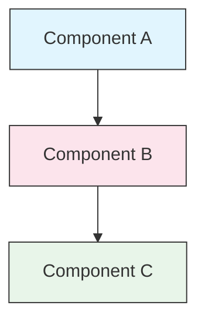

<picture>
  <source media="(prefers-color-scheme: dark)" srcset="resources/logos/claude-howto-logo-dark.svg">
  
</picture>

# Руководство по стилю

> Соглашения и правила форматирования для внесения вклада в Claude How To. Следуйте этому руководству для поддержания консистентности, профессионализма и лёгкости поддержки контента.

---

## Содержание

- [Именование файлов и папок](#именование-файлов-и-папок)
- [Структура документа](#структура-документа)
- [Заголовки](#заголовки)
- [Форматирование текста](#форматирование-текста)
- [Списки](#списки)
- [Таблицы](#таблицы)
- [Блоки кода](#блоки-кода)
- [Ссылки и перекрёстные ссылки](#ссылки-и-перекрёстные-ссылки)
- [Диаграммы](#диаграммы)
- [Использование эмодзи](#использование-эмодзи)
- [YAML-фронтматтер](#yaml-фронтматтер)
- [Изображения и медиа](#изображения-и-медиа)
- [Тон и стиль](#тон-и-стиль)
- [Сообщения коммитов](#сообщения-коммитов)
- [Чеклист для авторов](#чеклист-для-авторов)

---

## Именование файлов и папок

### Папки уроков

Папки уроков используют **двузначный числовой префикс** с последующим **kebab-case** дескриптором:

```
01-slash-commands/
02-memory/
03-skills/
04-subagents/
05-mcp/
```

Число отражает порядок пути обучения от начинающего до продвинутого.

### Имена файлов

| Тип | Соглашение | Примеры |
|------|-----------|----------|
| **README урока** | `README.md` | `01-slash-commands/README.md` |
| **Файл функции** | Kebab-case `.md` | `code-reviewer.md`, `generate-api-docs.md` |
| **Shell-скрипт** | Kebab-case `.sh` | `format-code.sh`, `validate-input.sh` |
| **Конфигурационный файл** | Стандартные имена | `.mcp.json`, `settings.json` |
| **Файл памяти** | Префикс области | `project-CLAUDE.md`, `personal-CLAUDE.md` |
| **Документы верхнего уровня** | UPPER_CASE `.md` | `CATALOG.md`, `QUICK_REFERENCE.md`, `CONTRIBUTING.md` |
| **Изображения** | Kebab-case | `pr-slash-command.png`, `claude-howto-logo.svg` |

### Правила

- Используйте **нижний регистр** для всех имён файлов и папок (кроме документов верхнего уровня типа `README.md`, `CATALOG.md`)
- Используйте **дефисы** (`-`) как разделители слов, никогда нижние подчёркивания или пробелы
- Держите имена описательными, но краткими

---

## Структура документа

### Корневой README

Корневой `README.md` следует такому порядку:

1. Логотип (элемент `<picture>` с вариантами для тёмной/светлой темы)
2. Заголовок H1
3. Вводная цитата (однострочное предложение ценности)
4. Раздел "Почему это руководство?" с таблицей сравнения
5. Горизонтальная черта (`---`)
6. Содержание
7. Каталог функций
8. Быстрая навигация
9. Путь обучения
10. Разделы функций
11. Начало работы
12. Лучшие практики / Устранение неполадок
13. Вклад / Лицензия

### README урока

Каждый `README.md` урока следует такому порядку:

1. Заголовок H1 (например, `# Slash Commands`)
2. Краткий обзорный абзац
3. Таблица быстрой справки (опционально)
4. Архитектурная диаграмма (Mermaid)
5. Детальные разделы (H2)
6. Практические примеры (нумерованные, 4-6 примеров)
7. Лучшие практики (таблицы Делать и Не делать)
8. Устранение неполадок
9. Связанные руководства / Официальная документация
10. Подвал с метаданными документа

### Файл функции/примера

Индивидуальные файлы функций (например, `optimize.md`, `pr.md`):

1. YAML-фронтматтер (если применимо)
2. Заголовок H1
3. Назначение / описание
4. Инструкции по использованию
5. Примеры кода
6. Советы по кастомизации

### Разделители разделов

Используйте горизонтальные черты (`---`) для разделения основных областей документа:

```markdown
---

## Новый основной раздел
```

Размещайте их после вводной цитаты и между логически различными частями документа.

---

## Заголовки

### Иерархия

| Уровень | Использование | Пример |
|-------|-----|---------|
| `#` H1 | Заголовок страницы (один на документ) | `# Slash Commands` |
| `##` H2 | Основные разделы | `## Best Practices` |
| `###` H3 | Подразделы | `### Adding a Skill` |
| `####` H4 | Под-подразделы (редко) | `#### Configuration Options` |

### Правила

- **Один H1 на документ** — только заголовок страницы
- **Никогда не пропускайте уровни** — не переходите от H2 к H4
- **Держите заголовки краткими** — стремитесь к 2-5 словам
- **Используйте sentence case** — заглавная только первая буква и имена собственные (исключение: названия функций остаются как есть)
- **Добавляйте префиксы-эмодзи только в заголовки разделов root README** (см. [Использование эмодзи](#использование-эмодзи))

---

## Форматирование текста

### Выделение

| Стиль | Когда использовать | Пример |
|-------|------------|---------|
| **Жирный** (`**text**`) | Ключевые термины, метки в таблицах, важные концепции | `**Installation**:` |
| *Курсив* (`*text*`) | Первое использование технического термина, названия книг/документов | `*frontmatter*` |
| `Код` (`` `text` ``) | Имена файлов, команды, значения конфигурации, ссылки на код | `` `CLAUDE.md` `` |

### Цитаты для выделений

Используйте цитаты с жирными префиксами для важных примечаний:

```markdown
> **Note**: Custom slash commands have been merged into skills since v2.0.

> **Important**: Never commit API keys or credentials.

> **Tip**: Combine memory with skills for maximum effectiveness.
```

Поддерживаемые типы выделений: **Note**, **Important**, **Tip**, **Warning**.

### Абзацы

- Держите абзацы короткими (2-4 предложения)
- Добавляйте пустую строку между абзацами
- Начинайте с ключевого пункта, затем давайте контекст
- Объясняйте «почему», а не только «что"

---

## Списки

### Неупорядоченные списки

Используйте тире (`-`) с отступом в 2 пробела для вложенности:

```markdown
- First item
- Second item
  - Nested item
  - Another nested item
    - Deep nested (avoid going deeper than 3 levels)
- Third item
```

### Упорядоченные списки

Используйте нумерованные списки для последовательных шагов, инструкций и ранжированных элементов:

```markdown
1. First step
2. Second step
   - Sub-point detail
   - Another sub-point
3. Third step
```

### Описательные списки

Используйте жирные метки для списков стиля ключ-значение:

```markdown
- **Performance bottlenecks** - identify O(n^2) operations, inefficient loops
- **Memory leaks** - find unreleased resources, circular references
- **Algorithm improvements** - suggest better algorithms or data structures
```

### Правила

- Поддерживайте консистентный отступ (2 пробела на уровень)
- Добавляйте пустую строку до и после списка
- Держите элементы списка параллельными по структуре (все начинаются с глагола или все существительные и т.д.)
- Избегайте вложенности глубже 3 уровней

---

## Таблицы

### Стандартный формат

```markdown
| Column 1 | Column 2 | Column 3 |
|----------|----------|----------|
| Data     | Data     | Data     |
```

### Типичные паттерны таблиц

**Сравнение функций (3-4 столбца):**

```markdown
| Feature | Invocation | Persistence | Best For |
|---------|-----------|------------|----------|
| **Slash Commands** | Manual (`/cmd`) | Session only | Quick shortcuts |
| **Memory** | Auto-loaded | Cross-session | Long-term learning |
```

**Делать и Не делать:**

```markdown
| Do | Don't |
|----|-------|
| Use descriptive names | Use vague names |
| Keep files focused | Overload a single file |
```

**Быстрая справка:**

```markdown
| Aspect | Details |
|--------|---------|
| **Purpose** | Generate API documentation |
| **Scope** | Project-level |
| **Complexity** | Intermediate |
```

### Правила

- **Выделяйте жирным заголовки таблиц**, когда они являются метками строк (первый столбец)
- Выравнивайте вертикальные черты для читаемости исходника (опционально, но предпочтительно)
- Держите содержимое ячеек кратким; используйте ссылки для деталей
- Используйте `форматирование кода` для команд и путей файлов внутри ячеек

---

## Блоки кода

### Языковые теги

Всегда указывайте языковой тег для подсветки синтаксиса:

| Язык | Тег | Использование |
|----------|-----|---------|
| Shell | `bash` | CLI-команды, скрипты |
| Python | `python` | Python-код |
| JavaScript | `javascript` | JS-код |
| TypeScript | `typescript` | TS-код |
| JSON | `json` | Конфигурационные файлы |
| YAML | `yaml` | Фронтматтер, конфиг |
| Markdown | `markdown` | Примеры Markdown |
| SQL | `sql` | Запросы к базам данных |
| Обычный текст | (без тега) | Ожидаемый вывод, деревья директорий |

### Соглашения

```bash
# Комментарий, объясняющий что делает команда
claude mcp add notion --transport http https://mcp.notion.com/mcp
```

- Добавляйте **строку комментария** перед неочевидными командами
- Делайте все примеры **готовыми к копированию**
- Показывайте **простую и продвинутую** версии, когда уместно
- Включайте **ожидаемый вывод**, когда это помогает пониманию (используйте блок без тега)

### Блоки установки

Используйте этот паттерн для инструкций по установке:

```bash
# Копировать файлы в ваш проект
cp 01-slash-commands/*.md .claude/commands/
```

### Многошаговые рабочие процессы

```bash
# Шаг 1: Создать директорию
mkdir -p .claude/commands

# Шаг 2: Копировать шаблоны
cp 01-slash-commands/*.md .claude/commands/

# Шаг 3: Проверить установку
ls .claude/commands/
```

---

## Ссылки и перекрёстные ссылки

### Внутренние ссылки (относительные)

Используйте относительные пути для всех внутренних ссылок:

```markdown
[Slash Commands](01-slash-commands/)
[Skills Guide](03-skills/)
[Memory Architecture](02-memory/#memory-architecture)
```

Из папки урока в корень или на соседний уровень:

```markdown
[Back to main guide](../README.md)
[Related: Skills](../03-skills/)
```

### Внешние ссылки (абсолютные)

Используйте полные URL с описательным якорным текстом:

```markdown
[Официальная документация Anthropic](https://code.claude.com/docs/en/overview)
```

- Никогда не используйте "click here" или "this link" как якорный текст
- Используйте описательный текст, который имеет смысл вне контекста

### Якоря разделов

Ссылайтесь на разделы внутри того же документа, используя GitHub-стиль якорей:

```markdown
[Feature Catalog](#-feature-catalog)
[Best Practices](#best-practices)
```

### Паттерн связанных руководств

Завершайте уроки разделом связанных руководств:

```markdown
## Related Guides

- [Slash Commands](../01-slash-commands/) - Quick shortcuts
- [Memory](../02-memory/) - Persistent context
- [Skills](../03-skills/) - Reusable capabilities
```

---

## Диаграммы

### Mermaid

Используйте Mermaid для всех диаграмм. Поддерживаемые типы:

- `graph TB` / `graph LR` — архитектура, иерархия, поток
- `sequenceDiagram` — потоки взаимодействий
- `timeline` — хронологические последовательности

### Соглашения по стилю

Применяйте консистентные цвета с использованием блоков стилей:



**Цветовая палитра:**

| Цвет | Hex | Использование |
|-------|-----|---------|
| Светло-синий | `#e1f5fe` | Первичные компоненты, вводы |
| Светло-розовый | `#fce4ec` | Обработка, middleware |
| Светло-зелёный | `#e8f5e9` | Выводы, результаты |
| Светло-жёлтый | `#fff9c4` | Конфигурация, опциональное |
| Светло-фиолетовый | `#f3e5f5` | Пользовательский интерфейс |

### Правила

- Используйте `["Label text"]` для меток узлов (позволяет использовать спецсимволы)
- Используйте `<br/>` для переносов строк внутри меток
- Держите диаграммы простыми (макс. 10-12 узлов)
- Добавляйте краткое текстовое описание под диаграммой для доступности
- Используйте сверху-вниз (`TB`) для иерархий, слева-направо (`LR`) для рабочих процессов

---

## Использование эмодзи

### Где используются эмодзи

Эмодзи используются **умеренно и целенаправленно** — только в специфических контекстах:

| Контекст | Эмодзи | Пример |
|---------|--------|---------|
| Заголовки разделов root README | Иконки категорий | `## 📚 Learning Path` |
| Индикаторы уровня навыков | Цветные круги | 🟢 Beginner, 🔵 Intermediate, 🔴 Advanced |
| Делать и Не делать | Галочка/крест | ✅ Do this, ❌ Don't do this |
| Оценки сложности | Звёзды | ⭐⭐⭐ |

### Стандартный набор эмодзи

| Эмодзи | Значение |
|-------|---------|
| 📚 | Обучение, руководства, документация |
| ⚡ | Начало работы, быстрая справка |
| 🎯 | Функции, быстрая справка |
| 🎓 | Пути обучения |
| 📊 | Статистика, сравнения |
| 🚀 | Установка, быстрые команды |
| 🟢 | Уровень начинающего |
| 🔵 | Средний уровень |
| 🔴 | Продвинутый уровень |
| ✅ | Рекомендуемая практика |
| ❌ | Избегать / антипаттерн |
| ⭐ | Единица оценки сложности |

### Правила

- **Никогда не используйте эмодзи в основном тексте** или абзацах
- **Используйте эмодзи только в заголовках** на root README (не в README уроков)
- **Не добавляйте декоративные эмодзи** — каждое эмодзи должно нести смысл
- Держите использование эмодзи консистентным с таблицей выше

---

## YAML-фронтматтер

### Файлы функций (Навыки, Команды, Агенты)

```yaml
---
name: unique-identifier
description: What this feature does and when to use it
allowed-tools: Bash, Read, Grep
---
```

### Опциональные поля

```yaml
---
name: my-feature
description: Brief description
argument-hint: "[file-path] [options]"
allowed-tools: Bash, Read, Grep, Write, Edit
model: opus                        # opus, sonnet, or haiku
disable-model-invocation: true     # User-only invocation
user-invocable: false              # Hidden from user menu
context: fork                      # Run in isolated subagent
agent: Explore                     # Agent type for context: fork
---
```

### Правила

- Размещайте фронтматтер в самом начале файла
- Используйте **kebab-case** для поля `name`
- Держите `description` в одном предложении
- Включайте только необходимые поля

---

## Изображения и медиа

### Паттерн логотипа

Все документы, начинающиеся с логотипа, используют элемент `<picture>` для поддержки тёмной/светлой темы:

```html
<picture>
  <source media="(prefers-color-scheme: dark)" srcset="resources/logos/claude-howto-logo-dark.svg">
  
</picture>
```

### Скриншоты

- Храните в соответствующей папке урока (например, `01-slash-commands/pr-slash-command.png`)
- Используйте kebab-case имена файлов
- Включайте описательный alt-текст
- Предпочитайте SVG для диаграмм, PNG для скриншотов

### Правила

- Всегда предоставляйте alt-текст для изображений
- Держите размеры файлов разумными (< 500KB для PNG)
- Используйте относительные пути для ссылок на изображения
- Храните изображения в той же директории, что и документ, или в `assets/` для общих изображений

---

## Тон и стиль

### Стиль письма

- **Профессиональный, но доступный** — техническая точность без перегруза жаргоном
- **Активный залог** — "Создайте файл", а не "Файл должен быть создан"
- **Прямые инструкции** — "Запустите эту команду", а не "Вам может захотеться запустить эту команду"
- **Дружелюбный к начинающим** — предполагайте, что читатель новичок в Claude Code, но не новичок в программировании

### Принципы контента

| Принцип | Пример |
|-----------|---------|
| **Показывай, не рассказывай** | Предоставляйте рабочие примеры, а не абстрактные описания |
| **Прогрессивная сложность** | Начинайте просто, добавляйте глубину в последующих разделах |
| **Объясняй "почему"** | "Используйте память для... потому что...", а не просто "Используйте память для..." |
| **Готово к копированию** | Каждый блок кода должен работать при прямой вставке |
| **Реальный контекст** | Используйте практические сценарии, а не надуманные примеры |

### Словарь

- Используйте "Claude Code" (не "Claude CLI" или "the tool")
- Используйте "skill" (не "custom command" — устаревший термин)
- Используйте "lesson" или "guide" для нумерованных разделов
- Используйте "example" для индивидуальных файлов функций

---

## Сообщения коммитов

Следуйте [Conventional Commits](https://www.conventionalcommits.org/):

```
type(scope): description
```

### Типы

| Тип | Использование |
|------|---------|
| `feat` | Новая функция, пример или руководство |
| `fix` | Исправление ошибки, коррекция, битая ссылка |
| `docs` | Улучшения документации |
| `refactor` | Реструктуризация без изменения поведения |
| `style` | Только изменения форматирования |
| `test` | Добавление или изменение тестов |
| `chore` | Сборка, зависимости, CI |

### Области

Используйте имя урока или область файла как область:

```
feat(slash-commands): Add API documentation generator
docs(memory): Improve personal preferences example
fix(README): Correct table of contents link
docs(skills): Add comprehensive code review skill
```

---

## Подвал с метаданными документа

README уроков заканчиваются блоком метаданных:

```markdown
---
**Last Updated**: March 2026
**Claude Code Version**: 2.1+
**Compatible Models**: Claude Sonnet 4.6, Claude Opus 4.6, Claude Haiku 4.5
```

- Используйте формат месяц + год (например, "March 2026")
- Обновляйте версию при изменении функций
- Перечисляйте все совместимые модели

---

## Чеклист для авторов

Перед отправкой контента проверьте:

- [ ] Имена файлов/папок используют kebab-case
- [ ] Документ начинается с заголовка H1 (один на файл)
- [ ] Иерархия заголовков корректна (без пропусков уровней)
- [ ] Все блоки кода имеют языковые теги
- [ ] Примеры кода готовы к копированию
- [ ] Внутренние ссылки используют относительные пути
- [ ] Внешние ссылки имеют описательный якорный текст
- [ ] Таблицы правильно отформатированы
- [ ] Эмодзи следуют стандартному набору (если используются)
- [ ] Диаграммы Mermaid используют стандартную цветовую палитру
- [ ] Нет конфиденциальной информации (API-ключи, учётные данные)
- [ ] YAML-фронтматтер валиден (если применимо)
- [ ] У изображений есть alt-текст
- [ ] Абзацы короткие и сфокусированные
- [ ] Раздел связанных руководств ссылается на соответствующие уроки
- [ ] Сообщение коммита следует формату conventional commits
