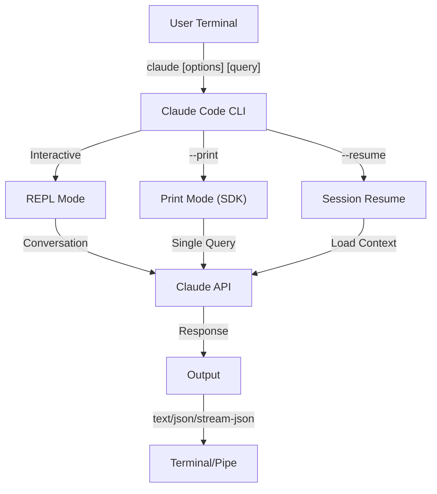
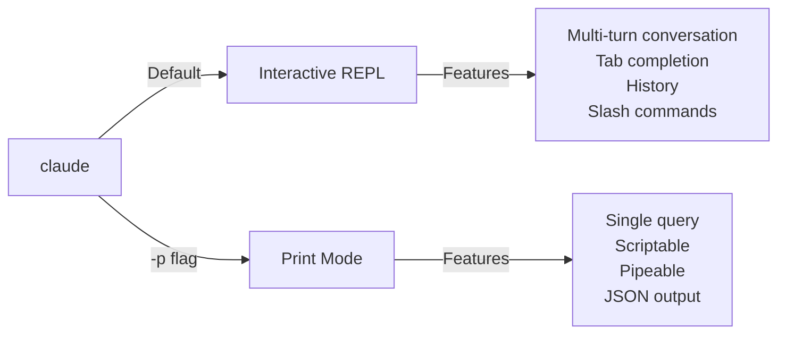

<picture>
  <source media="(prefers-color-scheme: dark)" srcset="../resources/logos/claude-howto-logo-dark.svg">
  
</picture>

# Tham Chiếu CLI / CLI Reference

## Tổng Quan / Overview

CLI Claude Code (Command Line Interface) là cách chính để tương tác với Claude Code. Nó cung cấp các tùy chọn mạnh mẽ để chạy các truy vấn, quản lý sessions, cấu hình mô hình, và tích hợp Claude vào workflows phát triển của bạn.

## Kiến Trúc / Architecture



## Các Lệnh CLI / CLI Commands

| Lệnh | Mô Tả | Ví Dụ |
|---------|-------------|---------|
| `claude` | Bắt đầu REPL tương tác | `claude` |
| `claude "query"` | Bắt đầu REPL với prompt ban đầu | `claude "explain this project"` |
| `claude -p "query"` | Chế độ in - query sau đó thoát | `claude -p "explain this function"` |
| `cat file \| claude -p "query"` | Xử lý nội dung được pipe | `cat logs.txt \| claude -p "explain"` |
| `claude -c` | Tiếp tục hội thoại gần đây nhất | `claude -c` |
| `claude -c -p "query"` | Tiếp tục trong chế độ in | `claude -c -p "check for type errors"` |
| `claude -r "<session>" "query"` | Resume session theo ID hoặc tên | `claude -r "auth-refactor" "finish this PR"` |
| `claude update` | Cập nhật đến phiên bản mới nhất | `claude update` |
| `claude mcp` | Cấu hình MCP servers | Xem [Tài liệu MCP](../05-mcp/) |
| `claude mcp serve` | Chạy Claude Code như một MCP server | `claude mcp serve` |
| `claude agents` | Liệt kê tất cả các subagents được cấu hình | `claude agents` |
| `claude auto-mode defaults` | In các quy tắc mặc định chế độ tự động như JSON | `claude auto-mode defaults` |
| `claude remote-control` | Bắt đầu server Remote Control | `claude remote-control` |
| `claude plugin` | Quản lý plugins (cài đặt, kích hoạt, vô hiệu hóa) | `claude plugin install my-plugin` |
| `claude auth login` | Đăng nhập (hỗ trợ `--email`, `--sso`) | `claude auth login --email user@example.com` |
| `claude auth logout` | Đăng xuất khỏi tài khoản hiện tại | `claude auth logout` |
| `claude auth status` | Kiểm tra trạng thái auth (exit 0 nếu đã đăng nhập, 1 nếu chưa) | `claude auth status` |

## Các Cờ Chính / Core Flags

| Cờ | Mô Tả | Ví Dụ |
|------|-------------|---------|
| `-p, --print` | In phản hồi mà không có chế độ tương tác | `claude -p "query"` |
| `-c, --continue` | Tải hội thoại gần đây nhất | `claude --continue` |
| `-r, --resume` | Resume session cụ thể theo ID hoặc tên | `claude --resume auth-refactor` |
| `-v, --version` | In số phiên bản | `claude -v` |
| `-w, --worktree` | Bắt đầu trong git worktree cô lập | `claude -w` |
| `-n, --name` | Tên hiển thị session | `claude -n "auth-refactor"` |
| `--from-pr <number>` | Resume sessions được liên kết đến GitHub PR | `claude --from-pr 42` |
| `--remote "task"` | Tạo session web trên claude.ai | `claude --remote "implement API"` |
| `--remote-control, --rc` | Session tương tác với Remote Control | `claude --rc` |
| `--teleport` | Resume session web cục bộ | `claude --teleport` |
| `--teammate-mode` | Chế độ hiển thị agent team | `claude --teammate-mode tmux` |
| `--bare` | Chế độ tối thiểu (bỏ qua hooks, skills, plugins, MCP, auto memory, CLAUDE.md) | `claude --bare` |
| `--enable-auto-mode` | Mở khóa chế độ quyền tự động | `claude --enable-auto-mode` |
| `--channels` | Đăng ký các plugin kênh MCP | `claude --channels discord,telegram` |
| `--chrome` / `--no-chrome` | Bật/tắt tích hợp trình duyệt Chrome | `claude --chrome` |
| `--effort` | Đặt mức độ suy nghĩ | `claude --effort high` |
| `--init` / `--init-only` | Chạy các hooks khởi tạo | `claude --init` |
| `--maintenance` | Chạy các hooks bảo trì và thoát | `claude --maintenance` |
| `--disable-slash-commands` | Vô hiệu hóa tất cả skills và lệnh slash | `claude --disable-slash-commands` |
| `--no-session-persistence` | Vô hiệu hóa lưu session (chế độ in) | `claude -p --no-session-persistence "query"` |

### Tương Tác vs Chế Độ In / Interactive vs Print Mode



**Chế Độ Tương Tác** (mặc định):
```bash
# Bắt đầu session tương tác
claude

# Bắt đầu với prompt ban đầu
claude "explain the authentication flow"
```

**Chế Độ In** (không tương tác):
```bash
# Query đơn, sau đó thoát
claude -p "what does this function do?"

# Xử lý nội dung file
cat error.log | claude -p "explain this error"

# Chuỗi với các công cụ khác
claude -p "list todos" | grep "URGENT"
```

## Mô Hình & Cấu Hình / Model & Configuration

| Cờ | Mô Tả | Ví Dụ |
|------|-------------|---------|
| `--model` | Đặt mô hình (sonnet, opus, haiku, hoặc tên đầy đủ) | `claude --model opus` |
| `--fallback-model` | Fallback mô hình tự động khi quá tải | `claude -p --fallback-model sonnet "query"` |
| `--agent` | Chỉ định agent cho session | `claude --agent my-custom-agent` |
| `--agents` | Định nghĩa subagents tùy chỉnh qua JSON | Xem [Tác Nhân Con](../04-subagents/) |
| `--effort` | Đặt mức độ effort (low, medium, high, max) | `claude --effort high` |

### Ví Dụ Chọn Mô Hình / Model Selection Examples

```bash
# Sử dụng Opus 4.6 cho các tác vụ phức tạp
claude --model opus "design a caching strategy"

# Sử dụng Haiku 4.5 cho các tác vụ nhanh
claude --model haiku -p "format this JSON"

# Tên mô hình đầy đủ
claude --model claude-sonnet-4-6-20250929 "review this code"

# Với fallback để đảm bảo độ tin cậy
claude -p --model opus --fallback-model sonnet "analyze architecture"

# Sử dụng opusplan (Opus plans, Sonnet executes)
claude --model opusplan "design and implement the caching layer"
```

## Tùy Chọn System Prompt / System Prompt Customization

| Cờ | Mô Tả | Ví Dụ |
|------|-------------|---------|
| `--system-prompt` | Thay thế toàn bộ prompt mặc định | `claude --system-prompt "You are a Python expert"` |
| `--system-prompt-file` | Tải prompt từ file (chế độ in) | `claude -p --system-prompt-file ./prompt.txt "query"` |
| `--append-system-prompt` | Append vào prompt mặc định | `claude --append-system-prompt "Always use TypeScript"` |

## Công Cụ & Quản Lý Quyền / Tool & Permission Management

| Cờ | Mô Tả | Ví Dụ |
|------|-------------|---------|
| `--tools` | Hạn chế các công cụ có sẵn | `claude -p --tools "Bash,Edit,Read" "query"` |
| `--allowedTools` | Các công cụ thực thi mà không cần prompt | `"Bash(git log:*)" "Read"` |
| `--disallowedTools` | Các công cụ bị xóa khỏi ngữ cảnh | `"Bash(rm:*)" "Edit"` |
| `--dangerously-skip-permissions` | Bỏ qua tất cả các prompt quyền | `claude --dangerously-skip-permissions` |
| `--permission-mode` | Bắt đầu trong chế độ quyền được chỉ định | `claude --permission-mode auto` |
| `--permission-prompt-tool` | Công cụ MCP để xử lý quyền | `claude -p --permission-prompt-tool mcp_auth "query"` |
| `--enable-auto-mode` | Mở khóa chế độ quyền tự động | `claude --enable-auto-mode` |

### Ví Dụ Quyền / Permission Examples

```bash
# Chế độ read-only để review code
claude --permission-mode plan "review this codebase"

# Hạn chế đến các công cụ an toàn chỉ
claude --tools "Read,Grep,Glob" -p "find all TODO comments"

# Cho phép các lệnh git cụ thể mà không cần prompts
claude --allowedTools "Bash(git status:*)" "Bash(git log:*)"

# Chặn các thao tác nguy hiểm
claude --disallowedTools "Bash(rm -rf:*)" "Bash(git push --force:*)"
```

## Đầu Ra & Định Dạng / Output & Format

| Cờ | Mô Tả | Tùy Chọn | Ví Dụ |
|------|-------------|---------|---------|
| `--output-format` | Chỉ định định dạng đầu ra (chế độ in) | `text`, `json`, `stream-json` | `claude -p --output-format json "query"` |
| `--input-format` | Chỉ định định dạng đầu vào (chế độ in) | `text`, `stream-json` | `claude -p --input-format stream-json` |
| `--verbose` | Bật ghi nhật chi tiết | | `claude --verbose` |
| `--include-partial-messages` | Bao gồm các sự kiện streaming | Yêu cầu `stream-json` | `claude -p --output-format stream-json --include-partial-messages "query"` |

## Tài Nguyên Thêm / Additional Resources

- [Tài Liệu CLI Chính Thức](https://code.claude.com/docs/en/cli-reference)
- [Tài Liệu MCP](../05-mcp/) - Cấu hình MCP servers
- [Slash Commands](../01-slash-commands/) - Các phím tắt có thể tái sử dụng
- [Plugins](../07-plugins/) - Các gói mở rộng có thể cài đặt
